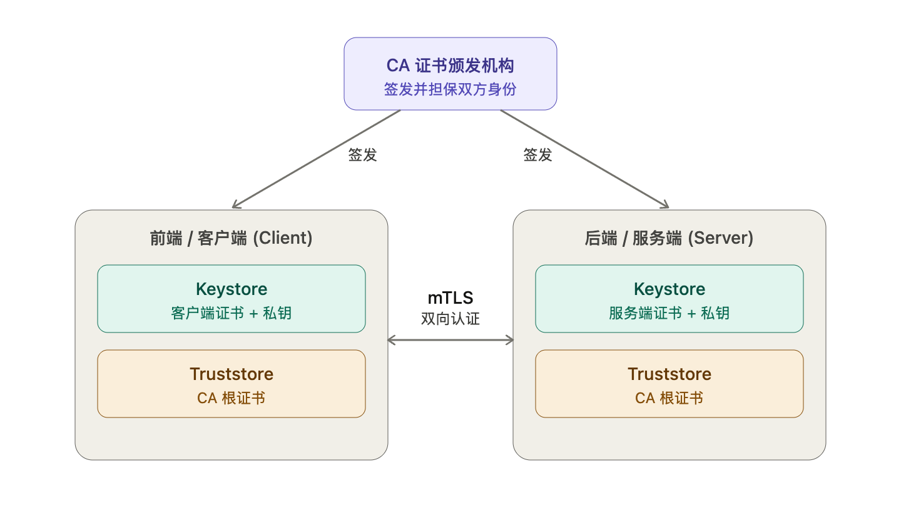
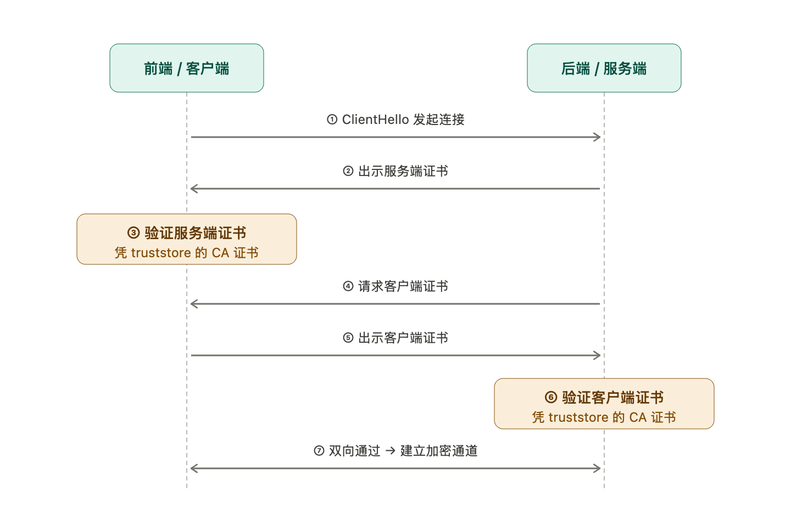
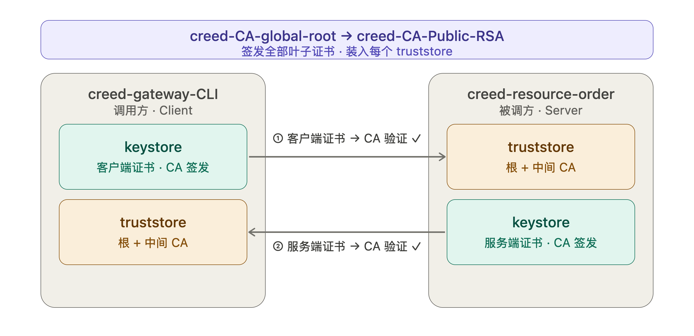
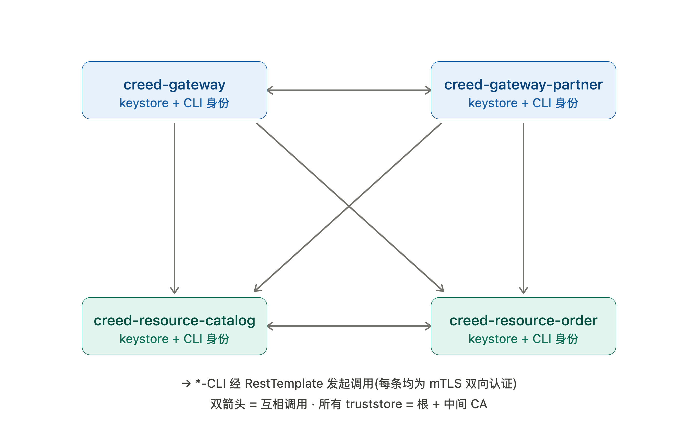

# 一文捋清SSL证书 

## KeyStore 和 TrustStore的区别及联系

KeyStore用于[服务器](https://cloud.tencent.com/product/cvm/?from_column=20065&from=20065)认证服务端，而TrustStore用于客户端认证服务器。

**keystore是存储密钥（公钥、私钥）的容器。**

**keystore和truststore其本质都是keystore。只不过二者存放的密钥所有者不同而已。本质都是相同的文件，只不过约定通过文件名称区分类型以及用途**

**对于keystore一般存储自己的私钥和公钥，而truststore则用来存储自己信任的对象的公钥。**

> 比如在客户端(服务请求方)对服务器(服务提供方)发起一次HTTPS请求时,服务器需要向客户端提供认证以便客户端确认这个服务器是否可信。这里，*服务器向客户端提供的认证信息就是自身的证书和公钥，而这些信息，包括对应的私钥，服务器就是通过KeyStore来保存的*。当服务器提供的证书和公钥到了客户端，客户端就要生成一个TrustStore文件保存这些来自[服务器证书](https://cloud.tencent.com/product/ssl?from_column=20065&from=20065)和公钥。

KeyStore 和 TrustStore的不同，也主要是通过上面所描述的使用目的的不同来区分的，在Java中这两种文件都可以通过keytool来完成。不过因为其保存的信息的敏感度不同，KeyStore文件通常需要密码保护。

正是因为 KeyStore 和 TrustStore Java中都可以通过 keytool 来管理的，所以在使用时多有混淆。记住以下几点，可以最大限度避免这些混淆 :

- 如果要保存你自己的密码，秘钥和证书，应该使用KeyStore，并且该文件要保持私密不外泄，不要传播该文件;
- 如果要保存你信任的来自他人的公钥和证书，应该使用TrustStore，而不是KeyStore;
- 在以上两种情况中的文件命名要尽量提示其安全敏感程度而不是有歧义或者误导 比如使用KeyStore的场景把文件命名为 truststore.jks,或者该使用TrustStore的情况下把文件命名为keystore.jks之类，这些用法都属于严重误导随后的使用者，有可能把比较私密的文件泄露出去；
- 拿到任何一个这样的文件时，确认清楚其内容然后决定怎样使用；

因为 KeyStore 文件既可以存储敏感信息，比如密码和私钥，也可以存储公开信息比如公钥，证书之类，所有实际上来讲，可以将KeyStore文件同样用做TrustStore文件,但这样做要确保使用者很明确自己永远不会将该KeyStore误当作TrustStore传播出去。

### **KeyStore**

内容 一个KeyStore文件可以包含私钥(private key)和关联的证书(certificate)或者一个证书链。证书链由客户端证书和一个或者多个CA证书。

KeyStore类型 KeyStore 文件有以下类型，一般可以通过文件扩展名部分来提示相应KeyStore文件的类型:

JCEKS JKS DKS PKCS11 PKCS12 Windows-MY BKS 以上KeyStore的类型并不要求在文件名上体现，但是使用者要明确所使用的KeyStore的格式。

### **TrustStore**

内容 一个TrustStore仅仅用来包含客户端信任的证书，所以，这是一个客户端*所信任的来自其他人或者组织的信息*的存储文件,而不能用于存储任何安全敏感信息，比如私钥(private key)或者密码。

客户端通常会包含一些大的CA机构的证书，这样当遇到新的证书时，客户端就可以使用这些CA机构的证书来验证这些新来的证书是否是合法的。


### 什么是 SSL/TLS 单向认证，双向认证 ？

**单向认证：**

​	**指的是只有一个对象校验对端的证书合法性。通常都是 client 来校验服务器的合法性。所以需要将服务器端的证书server.crt导出，导出的server.crt就是服务器端的公钥。然后将 server.crt 导入到客户端的 trustore 中。**

​	**这样服务器就被客户端信任了，连接时客户端使用服务器端的公钥去验证服务器。**

**双向认证：**

​	指的是相互校验，服务器需要校验每个 client，client 也需要校验服务器。server 需要 server.key、server.crt、ca.crt；client 需要 client.key、client.crt、ca.crt；

​	**服务器的公钥导入到客户端的truststore，客户端的公钥导入到服务器端的truststore中。**

​	**客户端请求服务器端，服务器端通过预置有客户端证书的 trust store 验证客户端的证书，如果证书被信任，则验证通过**

​	**服务器端响应客户端，客户端通过预置有服务端证书的 trust store 验证服务端的证书，如果证书被信任，则验证通过，完成一个双向认证过程。**

**JAVA 在jdk 中已经默认在 $JAVA_HOME/lib/security/cacerts 这个文件中预置了常用的 证书**


##  CA 在双向认证(mTLS)中与前后端的关系

CA 双向认证(mTLS)的核心可以拆成两张图来看。第一张说明"信任结构"——谁给谁签证书、双方各自存了什么;第二张说明"握手流程"——连接时双方是怎么互相验证的。

先看信任结构。关键点是:**CA 同时给前端和后端签发证书**,所以双方的证书都"出自同一个 CA";而每一方本地都存两样东西——`Keystore`(自己的证书 + 私钥,用来"证明我是谁")和 `Truststore`(CA 根证书,用来"验证对方是不是 CA 签的")。



**前端和后端的 keystore 必须各自独立**(各自的身份不同),但 **truststore 可以共用同一个 CA 根证书**——因为双方都只需要"信任同一个 CA"就能验证对方。图里青色 = keystore(证明自己),琥珀色 = truststore(验证对方)。

接下来是握手流程。注意验证是**双向**的:服务端要证明自己,客户端也要证明自己,两次验证都是拿各自 truststore 里的 CA 证书去校验对方证书的签名链。



把两张图串起来,关系可以总结成一句话:**CA 是双方的"共同信任锚点",它的签名让前后端无需事先交换证书也能互相验证身份。**

具体到三者关系:

- **CA ↔ 前端**:CA 给客户端签发证书,客户端把它放进自己的 keystore,握手时用来证明"我是合法客户端"。
- **CA ↔ 后端**:CA 给服务端签发证书,服务端放进自己的 keystore,用来证明"我是合法服务端"。
- **前端 ↔ 后端**:双方不直接信任对方,而是各自用 truststore 里的 CA 根证书去校验对方证书的签名链。只要两次校验都通过(②③ 验服务端、④⑤⑥ 验客户端),双向身份才算确认,加密通道才建立。

单向 TLS 只做第 ②③ 步(只验服务端);**双向 TLS 多了第 ④⑤⑥ 步**,服务端反过来也要验客户端,这就是 "mutual" 的含义。

落到 Spring Boot 的 SSL Bundle 配置上,对应关系也很直接:keystore 配 `bundle.<name>.keystore`(自身证书+私钥),truststore 配 `bundle.<name>.truststore`(CA 证书);服务端开启双向验证则是 `server.ssl.client-auth=need`。需要的话我可以接着画一张 SSL Bundle 配置项与这两个图的映射图。


## KeyTool 与 OpenSSL 常用的命令：

### **3.1 创建证书**

```shell
keytool -genkeypair -alias "test1" -keyalg "RSA" -keystore test.keystore.jks   
```

- **genkeypair**：生成一对非对称密钥;

- **alias**：指定密钥对的别名，该别名是公开的;
- **keyalg**：指定加密算法，本例中的采用通用的RAS加密算法;

- **keystore**:密钥库的路径及名称，不指定的话，默认在操作系统的用户目录下生成一个".keystore"的文件

### **3.2 查看 Keystore 的内容**

```shell
keytool -list -v -keystore test.keystore.jks
```

### **3.3 添加一个信任根证书到keystore文件**

```
keytool -import -alias newroot -file root.crt -keystore test.keystore.jks
```

### **3.4 导出 jks 的证书文件到指定文件** 

```
keytool -export -alias alias_name -keystore test.keystore.jks -rfc -file test.cer
```

### **3.5 删除jks 中指定别名的证书**

```
keytool -delete -keystore test.keystore.jks -alias alias_name
```

### 3.6  **将jks转为x.509**

#### ①. 将 keystore.jks 转为openssl的私钥并生成 .csr和 .crt

1. 将jks转为 .p12

   ```shell
   keytool -importkeystore -srckeystore keystore.jks -destkeystore keystore.p12 -srcstoretype JKS -deststoretype PKCS12 -srcstorepass your_password -deststorepass your_password -alias your_alias
   ```

2. 从 pkcs#12 中提取私钥和证书

   ```shell
   openssl pkcs12 -in keystore.p12 -nocerts -nodes -out keystore.key
   openssl pkcs12 -in keystore.p12 -clcerts -nokeys -out keystore.crt
   ```

3. 生成.csr文件

   ```shell
   openssl req -new -key keystore.key -out keystore.csr
   ```

4. 自签名生成crt文件 （optional）

   ```shell
   openssl x509 -req -days 365 -in keystore.csr -signkey keystore.key -out keystore.crt
   ```

#### ②. 将trust-store.jks转为openssl的crt并导出公钥

1. 将jks转为 .p12

   ```shell
   keytool -importkeystore -srckeystore trust-store.jks -destkeystore trust-store.p12 -srcstoretype JKS -deststoretype PKCS12 -srcstorepass your_password -deststorepass your_password -alias your_alias
   ```

2. 从 pkcs#12 中提取证书

   ```shell
   openssl pkcs12 -in trust-store.p12 -clcerts -nokeys -out trust-store.crt
   ```

#### ③. 验证私钥和证书的内容

1. 验证私钥

   ```shell
   openssl rsa -in keystore.key -check
   ```

2. 验证证书

   ```shell
   openssl x509 -in keystore.crt -text -noout
   ```

3. 验证trust store证书

   ```shell
   openssl x509 -in trust-store.crt -text -noout
   ```

#### ④. der转为pem

openssl将der转为pem

```shell
openssl x509 -inform der -in jwt-cer.der -out jwt-cer.pem
# 根据 .key .csr 生成 .crt
openssl x509 -signkey jwt-cer.pem -in domain.csr -req -days 365 -out domain.crt
# 提取公钥
openssl x509 -in domain.crt -pubkey -noout > domain-public.key
```

### 3.7 **将x.509转为jks**

#### ①. 合并私钥为p12格式

```shell
openssl pkcs12 -export -inkey creed-mall-ca.key -in creed-mall-ca.crt -out keystore.p12 -name root-creed-mall -password pass:changeit

# 添加CA证书以构建完整的证书链 https://stackoverflow.com/questions/19704950/load-multiple-certificates-into-pkcs12-with-openssl
openssl pkcs12 -export -inkey creed-mall-nginx.key -in creed-mall-nginx.crt -certfile creed-mall-ca.crt -out keystore_update.p12 -name creed-mall-nginx -password pass:changeit

```

> [!IMPORTANT]
>
> **openssl限制，无法实现导入多个p12,但是我们可以通过keytool实现**
>
> ```shell
> ⬇️⬇️⬇️⬇️⬇️⬇️⬇️⬇️⬇️⬇️⬇️⬇️⬇️⬇️⬇️⬇️⬇️⬇️⬇️⬇️⬇️⬇️
> openssl pkcs12 -export -inkey creed-mall-ca.key -in creed-mall-ca.crt -out creed-mall-ca.p12 -name root-creed-mall -password pass:changeit
> 
> openssl pkcs12 -export -inkey creed-mall-nginx.key -in creed-mall-nginx.crt -out creed-mall-nginx.p12 -name nginx-creed-mall -password pass:changeit
> #导入第一个.p12
> keytool -importkeystore -srckeystore creed-mall-ca.p12 -srcstoretype PKCS12 -srcstorepass changeit \
> -destkeystore keystore.jks -deststoretype JKS  -deststorepass changeit -alias root-creed-mall
> #导入第二个.p12
> keytool -importkeystore -srckeystore creed-mall-nginx.p12 -srcstoretype PKCS12 -srcstorepass changeit \
> -destkeystore keystore.jks -deststoretype JKS -deststorepass changeit -alias nginx-creed-mall
> 
> keytool -importkeystore -srckeystore keystore.jks -destkeystore keystore.p12 -srcstoretype JKS -deststoretype PKCS12 -srcstorepass changeit -deststorepass changeit <-alias root-creed-mall>(可选，如果不选则导出所有)
> ⬆️⬆️⬆️⬆️⬆️⬆️⬆️⬆️⬆️⬆️⬆️⬆️⬆️⬆️⬆️⬆️⬆️⬆️⬆️⬆️⬆️⬆️
> ```


#### ②. keytool p12转为jks格式

```shell
keytool -importkeystore -srckeystore keystore.p12 -srcstoretype PKCS12 -deststore keystore.jks -deststoretype JKS -srcstorepass changeit -deststorepass changeit 
```

#### ③. 将证书导入trust store

```shell
keytool -import -trustcacerts -file creed-mall-ca.crt -keystore truststore.jks -storepass changeit -alias root-creed-mall
keytool -import -trustcacerts -file creed-mall-nginx.crt -keystore truststore.jks -storepass changeit -alias nginx-creed-mall
```

#### ④. 验证结果

```shell
keytool -list -keystore keystore.jks -storepass changeit

keytool -list -keystore truststore.jks -storepass changeit
```

## OpenSSL 常用的命令：

### 1. 生成RSA私钥**

a. **生成私钥和证书**

```shell
openssl req -newkey rsa:2048 -nodes -subj "/C=SG/OU=Creed Root CA Ltd/O=Ethan Creed Limited/CN=ethan.com" -keyout creed-mall-ca.key -out creed-mall-ca.csr
```

b. **通过已有的 Private Key 来产生 CSR**

```shell
openssl req -new -key domain.key  -out domain.csr
```

c. **通过已有的 CRT 和 Private Key 来产生 CSR**

```shell
openssl x509 -in domain.crt -signkey domain.key -x509toreq -out domain.csr
```

d. 为私钥加密(不常用)

```shell
openssl rsa -in creed-mall-ca.key -aes256 -passout pass:changeit -out creed-mall-ca.key
# 私钥去除加密
openssl rsa -in creed-mall-ca.key -passin pass:changeit -out creed-mall-ca-nonpwd.key
```

### **2. 生成 CRTs Self-signed Root CA 证书文件**

如果你想要使用 SSL 来保证安全的连接，但是又不想去找 public CA 机构购买证书的话，那你就可以自己来生成 Self-signed Root CA 证书。

Self-signed 的证书也可以用来加密连接，只不过你的用户在访问你的网站的时候，将会提示出警告，说你的网站是不被信任的。因此当你开发的服务，并不需要提供给其他用户使用的时候 (e.g. non-production or non-public servers)，你才可以使用 Self-signed 形式的证书。

#### **⑴生成 Self-Signed 的证书**

以下命令将会生成一个 2048-bits 的 Private Key (`self-ca.key`) 和 Self-Signed 的 CRT 证书 (`self-ca.csr`)：

```shell
#生成 Self-Signed 的证书
openssl req -newkey rsa:2048 -nodes -subj "/C=SG/OU=Creed Root CA Ltd/O=Ethan Creed Limited/CN=ethan.com" -keyout self-ca.key -out self-ca.csr
```

其中`-x509` 选项是为了告诉 `req`，生成一个 self-signed 的 X509 证书。而 `-days 365` 表明生成的证书有效时间为 365 天。这条命令执行过程中，会产生一个临时的 CSR 文件，但执行结束后就被删除了。

以下命令是通过已有的 Private Key (`self-ca.key`)，来生成一个 Self-Signed 的 CRT 证书 (`self-ca.crt`)：

```shell
openssl req -key self-ca.key -new -x509 -days 365 -out self-ca.crt
```

以下命令是通过已有的 Private Key (`self-ca.key`) 以及请求文件 (`self-ca.csr`)，来生成一个 Self-Signed 的 CRT 证书 (`self-ca.crt`)：

```shell
openssl x509 -req -days 365 -in self-ca.csr -signkey self-ca.key -out self-ca.crt
```

以下命令是通过已有的  Self-Signed 的 CRT 证书 (`self-ca.crt`) 提取 Public Key(`public-ca.key`)

```shell
openssl x509 -in self-ca.crt -pubkey -noout  > self-ca.key
```

#### **⑵签发CRT 证书**

以下命令是生成 Server 需要的 Private Key & CSR ：

```shell
openssl req -newkey rsa:2048 -nodes -subj "/C=SG/OU=Creed Mall CA Ltd/O=Ethan Creed Limited/CN=nginx.ethan.com" -keyout domain.key -out domain.csr
```

以下命令是通过已有的 Self-Signed CA 的证书 (`self-ca.crt`) 和密钥 (`self-ca.key`)，和请求文件 CSR (`domain.csr`) 来签发生成 CRT 证书 (`domain.crt`)：

```shell
openssl x509 -req  -CAcreateserial -days 365 -CA self-ca.crt -CAkey self-ca.key -in domain.csr -out domain.crt
```


### **3. 校验证书**

**查看请求文件 CSR**

```shell
openssl req -text -noout -verify -in domain.csr
```

**查看证书文件 CRT**

```shell
openssl x509 -text -noout -in domain.crt
```

**校验证书文件 CRT 合法性**

以下命令来校验 `domain.crt` 证书，是否是由 `ca.crt` 证书签发出来的：

```shell
openssl verify -verbose -CAFile ca.crt domain.crt
```

**校验 Private Key & CSR & CRT 三者是否是匹配**

以下命令是分别提取出 Private Key (`domain.key`) & CSR (`domain.csr`) & CRT (`domain.crt`) 三者中包含的 Public Key，然后通过 md5 运算检查是否一致：

```shell
openssl rsa -noout -modulus -in domain.key | openssl md5
openssl req -noout -modulus -in domain.csr | openssl md5
openssl x509 -noout -modulus -in domain.crt | openssl md5
```


### **4. CRT 格式转换**

上面通过 **X509** 证书生成的证书，都是 **ASCII PEM 格式进行编码**的。然而证书也可以转换成其他格式，有些格式能够将 Private Key & CSR & CRT 三者全部打包在同一个文件中。

#### PEM 格式 vs DER 格式

> [!TIP]
>
> ***PEM格式*：*PEM*（Privacy Enhanced Mail）是一种常见的证书*格式*，它使用*Base64*编码的ASCII文本表示证书。**
>
> **DER - Distinguished Encoding Rules,打开看是二进制格式,不可读.**

The DER format is typically used with Java.

- **PEM 格式转成 DER 格式**

  ```shell
  openssl x509 -in domain.crt -outform der -out domain.der
  ```

- **DER 格式转成 PEM 格式**

  ```shell
  openssl x509 -inform der -in domain.der -out domain.crt
  ```

#### PEM 格式 vs PKCS7 格式 (不常用)

> PKCS7 files, also known as P7B, are typically used in Java Keystores and Microsoft IIS (Windows). They are ASCII files which can contain certificates and CA certificates.

- **PEM 格式转成 PKCS7 格式**

  ```shell
  openssl crl2pkcs7 -nocrl \
          -certfile domain.crt \
          -certfile ca-chain.crt \
          -out domain.p7b
  ```

- **PKCS7 格式转成 PEM 格式**

  ```shell
  openssl pkcs7 \
          -in domain.p7b \
          -print_certs -out domain.crt
  ```

如果你的 PKCS7 文件中包含了多个证书文件 (e.g. `domain.crt` & `ca.crt`) ，那上面命令生成的 PEM 文件中将同时包含所有被打包的证书。

#### PEM 格式 vs PKCS12 格式

> PKCS12 files, also known as PFX files, are typically used for importing and exporting certificate chains in Micrsoft IIS (Windows).

- **PEM 格式转成 PKCS12 格式**

  ```shell
  openssl pkcs12 \
          -inkey domain.key \
          -in domain.crt \
          -export -out domain.pfx
  ```

- **PKCS12 格式转成 PEM 格式**

  ```shell
  openssl pkcs12 \
          -in domain.pfx \
          -nodes -out domain.combined.crt
  ```

### 5. 为过期的证书续签

CA证书是保障网站安全的一种<a href="https://ssl.idcspy.net/">服务器证书</a>，具有固定的有效期，一旦过期，它将无法再被信任和使用。这可能会导致网站无法正常工作，因为浏览器会拒绝与该网站建立安全连接。因此，为了确保网站的正常使用不受影响，及时更新和延期CA证书至关重要。那么CA证书过期了该如何延期呢？

1. 获取新证书

   首先，需要从证书颁发机构(CA)获取新的CA证书。这通常涉及到注册并购买一个新的SSL证书，站主可以根据自己网站的特点购买适合的证书类型。

2. 安装新证书

   一旦站主获得了新的CA证书，就需要将其安装到服务器上，具体步骤可能因服务器类型和操作系统而异。一般来说，需要将新证书文件上传到服务器的特定目录，并配置Web服务器(如Apache或Nginx)以使用新证书。请注意，在配置过程中，可能需要替换现有的旧证书文件。

## 示例案例

我自己搭建的 Nginx Web Server 想要提供 HTTPS 连接方式，但是觉得不想花钱去找知名 CA 证书中心 (e.g. AWS Certificate Manager) 购买证书。于是我想通过 Self-Signed 的方式来解决我的需求：

1. 先生成 Self-Signed CA 证书：

```shell
openssl req \
        -newkey rsa:2048 -nodes -keyout self-ca.key \
        -x509 -days 365 -out self-ca.crt
```

2. 生成 Nginx Web Server 需要的 Private Key & CSR ：

```shell
openssl req \
        -newkey rsa:2048 -nodes -keyout nginx.key \
        -out nginx.csr
```

3. 利用 Self-Signed CA 证书，来签发业务所需要的 CRT 证书：

```shell
openssl x509 \
        -req -in nginx.csr \
        -out nginx.crt \
        -CAcreateserial -days 365 \
        -CA self-ca.crt -CAkey self-ca.key
```

经过了上面 3 个步奏后，你就得到了 `self-ca.crt` & `self-ca.key` ，以及由它签发出来的 `nginx.crt` & `nginx.key` 。

> [!IMPORTANT]
>
> 如何使用上面 4 个文件：首先将 `nginx.crt` & `nginx.key` 部署在 Nginx Web Server 上，然后将 `self-ca.crt` 发布给客户端即可。客户端就可以通过 `self-ca.crt` 与业务服务器建立 SSL/TLS 安全连接。

###  Tomcat 配置 ssl 认证

打开server.xml，找到

```xml
<!--

　　<Connector port="8443" protocol="HTTP/1.1" SSLEnabled="true"　　maxThreads="150" scheme="https" secure="true"　　clientAuth="false" sslProtocol="TLS" />

-->
```

这样一段注释，在这段注释下面添加如下一段代码：

```xml
<Connector SSLEnabled="true" acceptCount="100" clientAuth="false"
disableUploadTimeout="true"
enableLookups="false" maxThreads="25"
port="8443" keystoreFile="D:\developTools\apache-tomcat-idm\tomcat.keystore" keystorePass="111111"
protocol="org.apache.coyote.http11.Http11NioProtocol" scheme="https"
secure="true" sslProtocol="TLS" />
```

其中`clientAuth=”false”`表示是SSL单向认证，即服务端认证，port=”8443”是https的访问端口，keystoreFile="D:\developTools\apache-tomcat-idm\tomcat.keystore"是第一步中生成的keystore的保存路径，keystorePass="111111"是第一步生成的keystore的密码。


### PostMan添加新的客户端证书

1. 在**host**字段中，输入您要为其使用证书的请求 URL 的域（无协议），例如`https://postman-echo.com`. 您还可以在**端口**字段中指定与此域关联的自定义端口。这是可选的。如果留空，将使用默认的 HTTPS 端口 (443)。
2. **CRT file:** 为客户端密钥库的公钥。**（PEM 文件可以包含多个 CA 证书。）**
3. **KEY file:** 客户端密钥库的私钥。
4. **PFX file:** 密钥文件\*，或者\*为你的证书选择PFX 文件。
5. **filePassphrase:** Passphrase为私钥的密码（如果有的话）。

### .pfx 证书和 .cer 证书

- **PFX**：带有私钥的证书，由Public Key Cryptography Standards #12，PKCS#12标准定义，包含了公钥和私钥的二进制格式的证书形式，以.pfx作为证书文件后缀名。
- **DER**：**DER Encoded Binary (.der)** 二进制编码的证书，证书中没有私钥，DER 编码二进制格式的证书文件，以.der作为证书文件后缀名。
- **CER**：**Base64 Encoded(.cer)**，Base64编码的证书，证书中没有私钥，BASE64 编码格式的证书文件，也是以.cer作为证书文件后缀名。

**由定义可以看出，只有pfx格式的数字证书是包含有私钥的，cer格式的数字证书里面只有公钥没有私钥。**


参考：[玩转-SSL-证书](https://yakir-yang.github.io/2018/08/09/Tools-%E7%8E%A9%E8%BD%AC-SSL-%E8%AF%81%E4%B9%A6/)


### ‼️企业 mTLS PKI 布局

认证关系的核心是:**出示方的 keystore 证书 ←由→ 验证方的 truststore(CA)校验**。下面先用一条调用边把这层关系拆到最细——以 `creed-gateway-CLI` 调用 `creed-resource-order` 为例。注意左右两边 keystore / truststore 是**错位对齐**的:出示方的 keystore 正对验证方的 truststore,连线就是一次 CA 校验。



这条边的关系**对每一条调用都成立**,因为所有证书同源于 `creed-CA-Public-RSA`、所有 truststore 都装着同一条 CA 链。所以把它铺到整个服务网格上,就是下面这张调用拓扑图。每条箭头都是一次上图那样的双向认证(`CLI keystore` ↔ 对端 `truststore`,对端 `keystore` ↔ `CLI truststore`),方向 = `*-CLI` 用 RestTemplate 发起的出站调用。




```shell
creed-CA-global-root-{keystore,truststore}.p12      # 需求1 根CA
creed-CA-Public-RSA-{keystore,truststore}.p12       # 需求1 中间CA
creed-gateway-{keystore,truststore}.p12             # 需求2 服务端身份
creed-gateway-CLI-{keystore,truststore}.p12         # 需求2 RestTemplate 出站身份
creed-gateway-partner-{keystore,truststore}.p12     # 需求3
creed-gateway-partner-CLI-{keystore,truststore}.p12 # 需求3
creed-resource-catalog-{keystore,truststore}.p12    # 需求4
creed-resource-catalog-CLI-{keystore,truststore}.p12# 需求4
creed-resource-order-{keystore,truststore}.p12      # 需求5
creed-resource-order-CLI-{keystore,truststore}.p12  # 需求5
```

##### 生成命令 - Java

```shell
#!/usr/bin/env bash
set -euo pipefail

# ============================================================================
# Creed mTLS PKI generator  --  PKCS#12 keystores + truststores
#
# Hierarchy:
#   creed-CA-global-root            self-signed ROOT CA
#     └─ creed-CA-Public-RSA        INTERMEDIATE CA (issues every leaf cert)
#          ├─ creed-gateway            / creed-gateway-CLI
#          ├─ creed-gateway-partner    / creed-gateway-partner-CLI
#          ├─ creed-resource-catalog   / creed-resource-catalog-CLI
#          └─ creed-resource-order     / creed-resource-order-CLI
#
# Trust model:  every *-truststore.p12 = { root , intermediate }.
# All leaf certs are signed by creed-CA-Public-RSA, so any service trusts any
# peer in the mesh (CA-anchored mutual trust). The call-graph in the request
# (who calls whom) is satisfied automatically and needs no per-peer scoping.
#
# Per identity we mint TWO certs:
#   <svc>      serverAuth   -> inbound identity (presented when called)
#   <svc>-CLI  clientAuth   -> outbound identity (presented by RestTemplate)
# ============================================================================

# ---- config (override via env) ---------------------------------------------
OUT="${OUT:-./pki}"
DAYS_ROOT="${DAYS_ROOT:-3650}"
DAYS_INT="${DAYS_INT:-1825}"
DAYS_LEAF="${DAYS_LEAF:-825}"        # keep <=825d to satisfy modern TLS limits
CA_KEYSIZE="${CA_KEYSIZE:-4096}"
LEAF_KEYSIZE="${LEAF_KEYSIZE:-2048}"
SUBJ_BASE="${SUBJ_BASE:-/C=SG/O=Creed/OU=Platform}"

# One password here for clarity. In production use a distinct, KMS/Vault-managed
# password per bundle (your AES-GCM master + RSA-OAEP per-bundle scheme).
STOREPASS="${STOREPASS:-changeit}"

mkdir -p "$OUT"; cd "$OUT"

# ---- 1. ROOT CA : creed-CA-global-root -------------------------------------
openssl genrsa -out creed-CA-global-root.key "$CA_KEYSIZE"
openssl req -x509 -new -nodes -sha256 -days "$DAYS_ROOT" \
  -key creed-CA-global-root.key \
  -subj "${SUBJ_BASE}/CN=creed-CA-global-root" \
  -addext "basicConstraints=critical,CA:TRUE" \
  -addext "keyUsage=critical,keyCertSign,cRLSign" \
  -addext "subjectKeyIdentifier=hash" \
  -out creed-CA-global-root.crt

# ---- 2. INTERMEDIATE CA : creed-CA-Public-RSA ------------------------------
openssl genrsa -out creed-CA-Public-RSA.key "$CA_KEYSIZE"
openssl req -new -sha256 \
  -key creed-CA-Public-RSA.key \
  -subj "${SUBJ_BASE}/CN=creed-CA-Public-RSA" \
  -out creed-CA-Public-RSA.csr
openssl x509 -req -sha256 -days "$DAYS_INT" \
  -in creed-CA-Public-RSA.csr \
  -CA creed-CA-global-root.crt -CAkey creed-CA-global-root.key -CAcreateserial \
  -extfile <(printf "%s\n" \
      "basicConstraints=critical,CA:TRUE,pathlen:0" \
      "keyUsage=critical,keyCertSign,cRLSign" \
      "subjectKeyIdentifier=hash" \
      "authorityKeyIdentifier=keyid:always") \
  -out creed-CA-Public-RSA.crt

# chain bundled into every leaf keystore (leaf -> intermediate -> root)
cat creed-CA-Public-RSA.crt creed-CA-global-root.crt > ca-chain.crt

# ---- helpers ----------------------------------------------------------------
# make_keystore <name> <serverAuth|clientAuth>
make_keystore() {
  local name="$1" eku="$2"
  openssl genrsa -out "${name}.key" "$LEAF_KEYSIZE"
  openssl req -new -sha256 -key "${name}.key" \
    -subj "${SUBJ_BASE}/CN=${name}" -out "${name}.csr"
  openssl x509 -req -sha256 -days "$DAYS_LEAF" \
    -in "${name}.csr" \
    -CA creed-CA-Public-RSA.crt -CAkey creed-CA-Public-RSA.key -CAcreateserial \
    -extfile <(printf "%s\n" \
        "basicConstraints=critical,CA:FALSE" \
        "keyUsage=critical,digitalSignature,keyEncipherment" \
        "extendedKeyUsage=${eku}" \
        "subjectKeyIdentifier=hash" \
        "authorityKeyIdentifier=keyid:always" \
        "subjectAltName=DNS:${name},DNS:localhost") \
    -out "${name}.crt"
  openssl pkcs12 -export \
    -inkey "${name}.key" -in "${name}.crt" -certfile ca-chain.crt \
    -name "${name}" -passout pass:"${STOREPASS}" \
    -out "${name}-keystore.p12"
  rm -f "${name}.csr"
}

# make_truststore <name>   -> PKCS12 truststore containing root + intermediate
make_truststore() {
  local name="$1"; rm -f "${name}-truststore.p12"
  keytool -importcert -noprompt -trustcacerts \
    -alias creed-ca-global-root -file creed-CA-global-root.crt \
    -keystore "${name}-truststore.p12" -storetype PKCS12 -storepass "${STOREPASS}"
  keytool -importcert -noprompt -trustcacerts \
    -alias creed-ca-public-rsa -file creed-CA-Public-RSA.crt \
    -keystore "${name}-truststore.p12" -storetype PKCS12 -storepass "${STOREPASS}"
}


# ---- 1b. CA keystores + truststores ----------------------------------------
# CA keystores hold the signing keys -- guard tightly / move to HSM in prod.
openssl pkcs12 -export -inkey creed-CA-global-root.key -in creed-CA-global-root.crt \
  -name creed-CA-global-root -passout pass:"${STOREPASS}" \
  -out creed-CA-global-root-keystore.p12
openssl pkcs12 -export -inkey creed-CA-Public-RSA.key -in creed-CA-Public-RSA.crt \
  -certfile creed-CA-global-root.crt -name creed-CA-Public-RSA \
  -passout pass:"${STOREPASS}" -out creed-CA-Public-RSA-keystore.p12
make_truststore creed-CA-global-root
make_truststore creed-CA-Public-RSA

# ---- 2-5. service identities (server + CLI) --------------------------------
SERVICES=(creed-gateway creed-gateway-partner creed-resource-catalog creed-resource-order)
for svc in "${SERVICES[@]}"; do
  make_keystore   "${svc}"      serverAuth
  make_truststore "${svc}"
  make_keystore   "${svc}-CLI"  clientAuth
  make_truststore "${svc}-CLI"
done

echo "== done =="; ls -1 *.p12
```

##### 释义

> [!TIP]
>
> ### make_keystore — 生成"带私钥的身份"keystore
>
> `local name="$1" eku="$2"` 把两个位置参数声明为函数局部变量:`name` 是证书名(如 `creed-gateway`),`eku` 是 Extended Key Usage(`serverAuth` 或 `clientAuth`),后面靠它区分服务端证书和 CLI 证书。`local` 保证不污染全局变量。
>
> **第 1 步:生成私钥**
>
> ```
> openssl genrsa -out "${name}.key" "$LEAF_KEYSIZE"
> ```
>
> `genrsa` 生成 RSA 私钥;`-out` 指定输出文件;末尾的位置参数 `$LEAF_KEYSIZE`(脚本里是 2048)是密钥位数。注意这里生成的是**无口令的明文私钥**(没有 `-aes256` 之类),因为后面要直接打进 p12;落盘的 `.key` 在生产里要当敏感文件管理。`genrsa` 在 OpenSSL 3 里算 legacy 命令,等价的现代写法是 `openssl genpkey -algorithm RSA -pkeyopt rsa_keygen_bits:2048`。
>
> **第 2 步:生成 CSR(证书申请)**
>
> ```
> openssl req -new -sha256 -key "${name}.key" -subj "${SUBJ_BASE}/CN=${name}" -out "${name}.csr"
> ```
>
> `req -new` 生成一个新的 PKCS#10 证书申请;`-key` 复用上一步的私钥(而不是现场再生成);`-sha256` 是 CSR **自签名**用的摘要算法——CSR 会用申请者自己的私钥签一遍,证明"我持有这把私钥"(proof of possession);`-subj` 以非交互方式直接写死主题 DN,`SUBJ_BASE` 是 `/C=SG/O=Creed/OU=Platform`,拼上 `/CN=<name>`,`CN`(Common Name)就是这个身份的名字;`-out` 输出 `.csr`。
>
> **第 3 步:用中间 CA 签发证书**
>
> ```
> openssl x509 -req -sha256 -days "$DAYS_LEAF" -in "${name}.csr" \
>   -CA creed-CA-Public-RSA.crt -CAkey creed-CA-Public-RSA.key -CAcreateserial \
>   -extfile <(...) -out "${name}.crt"
> ```
>
> `x509` 本是证书查看/操作工具,加 `-req` 后表示"输入是一个 CSR,把它签成证书"(不加 `-req` 它会把输入当成已有证书)。`-sha256` 这次是 **CA 签发时**用的签名摘要。`-days` 是有效期,脚本用 825 天——这是贴着现代 TLS 叶子证书有效期上限(CA/Browser Forum 的历史 825 天红线)取的保守值。`-in` 是待签的 CSR。
>
> `-CA` / `-CAkey` 指定签发者:中间 CA 的证书和私钥;签发后,证书的 issuer 就是这张 CA 的 subject。`-CAcreateserial` 管理序列号文件(`creed-CA-Public-RSA.srl`):每张证书在同一 CA 下序列号必须唯一,这个文件不存在就创建并给初值,存在就读出来递增。OpenSSL 1.1 以后反复传 `-CAcreateserial` 是安全的;老版本里如果 `.srl` 已存在则要改用 `-CAserial xxx.srl`。
>
> `-extfile <(printf "%s\n" ...)` 是关键——它从一个文件读取 X.509 v3 扩展,这里用 **进程替换** `<(...)` 把 `printf` 的多行输出当成临时文件喂进去(顺带提醒:`<(...)` 是 bash 专属语法,用 `sh` 跑会报 `"(" unexpected`,这也是为什么脚本头部要写 `#!/usr/bin/env bash`)。各扩展含义:
>
> - `basicConstraints=critical,CA:FALSE` — 声明这是终端实体(叶子)证书,**不能**当 CA 用;`critical` 表示符合规范的客户端必须强制执行这条。
> - `keyUsage=critical,digitalSignature,keyEncipherment` — 密钥用途。`digitalSignature` 用于握手签名((EC)DHE 套件、客户端认证签名),`keyEncipherment` 用于 RSA 密钥交换时加密 premaster secret。TLS 1.3 全是 (EC)DHE、证书只做签名,真正用到的是 `digitalSignature`,`keyEncipherment` 属历史兼容但通常照带。
> - `extendedKeyUsage=${eku}` — 这条就是 server 与 CLI 的分水岭:`serverAuth`(OID 1.3.6.1.5.5.7.3.1,可做 TLS 服务端)或 `clientAuth`(1.3.6.1.5.5.7.3.2,可做 TLS 客户端)。
> - `subjectKeyIdentifier=hash` — SKI 扩展,对公钥做哈希得到,链构建时定位用。
> - `authorityKeyIdentifier=keyid:always` — AKI 扩展,指向**签发者的 SKI**,把本证书和它的 CA 串起来,验证方据此往上找父证书。
> - `subjectAltName=DNS:${name},DNS:localhost` — SAN。现代 TLS 客户端做主机名校验只看 SAN、不再看 CN(RFC 6125),所以服务端证书对 `<name>` 和 `localhost` 两个主机名有效;客户端证书不做主机名匹配,这里带上只是为了统一。
>
> `-out "${name}.crt"` 输出签好的证书。
>
> > `extendedKeyUsage` 的值本质是 **X.509 里的一串 OID(EKU 是个 OID 序列)**,openssl 允许你用三种方式写其中每一项,并用逗号叠加:
> >
> > 具名简写——openssl 内置了一张名字到 OID 的对照表,`serverAuth`、`clientAuth` 都是表里的别名(②里直接写它们的 OID `1.3.6.1.5.5.7.3.1` 结果完全一样)。原始 OID——任意点分 OID 直接写就行,openssl 不校验它"存不存在",照单全收(③ 那个 `1.3.6.1.4.1.99999.42.1` 是我瞎编的私有 OID,也照样写进去了)。两者还能混用(④)。
> >
> > 但有三点边界要注意。
> >
> > 第一,**具名值不是自由文本,必须在 openssl 的内置表里**,拼错(⑦ 的 `serverAuthh`)会直接报 `invalid object identifier` 失败。只有"原始 OID"这条路是不受限的。openssl 3 认识的常见具名值有:`serverAuth`、`clientAuth`、`codeSigning`、`emailProtection`、`timeStamping`、`OCSPSigning`、`msCodeInd`、`msCodeCom`、`msCTLSign`、`msEFS`、`ipsecIKE`,以及特殊的 `anyExtendedKeyUsage`(⑥,OID `2.5.29.37.0`,表示"任意用途")。
> >
> > 第二,**这个值不是装饰,它是会被强制执行的"限制"**。EKU 的语义是:一旦证书带了 EKU 扩展,这张证书就**只能**用于所列的那些用途;没列的用途即被禁止(完全不带 EKU 扩展才表示"不限用途")。而且 Java 的 SunJSSE TrustManager 在握手时**确实会校验 EKU**——服务端证书必须含 `serverAuth`(或 `anyExtendedKeyUsage`),客户端证书必须含 `clientAuth`,否则握手直接被拒。所以你不能把 `${eku}` 换成一个纯自定义 OID 就指望 mTLS 还能跑——那样服务端/客户端身份就"不合法"了。换句话说,对你这套脚本,这个位置真正能保证 TLS 工作的取值就是 `serverAuth` / `clientAuth`(或 `anyExtendedKeyUsage`,但那等于放弃了 server/client 的区分,不推荐)。
> >
> > 第三,**自定义 OID 可以加,但要加在 `serverAuth`/`clientAuth` 旁边,而不是替换它**。这是个正经的企业模式:比如想在证书里编码"这个客户端属于哪个业务域/有什么权限",就追加一段私有 OID,如 `extendedKeyUsage=clientAuth,1.3.6.1.4.1.<你们的企业号>.1.5`,TLS 层照常用 `clientAuth` 完成认证,应用层(或网关)再读出那段自定义 OID 做授权判断。自定义 OID 务必挂在你们自己注册的 IANA 私有企业号 arc(`1.3.6.1.4.1.<PEN>`)下,避免和别人撞。
> >
> > 补一个 `critical` 的坑(⑤):你可以加 `critical,` 把 EKU 标成关键扩展,但**EKU 一般建议保持非关键**。因为按 RFC 5280,关键 EKU 要求验证方对列表里每一个 OID 都"认识并接受";如果你把自定义 OID 和 `critical` 一起用,某些只认标准用途的客户端遇到不认识的 OID 就会直接拒绝整张证书。混了自定义 OID 时,保持非关键最安全。
> >
> > 所以回到你脚本里这行:`extendedKeyUsage=${eku}` 的 `${eku}` 是可以传任意值的(逗号叠加、原始 OID、自定义 OID 都行),但**对 mTLS 场景而言,它实际是受 TLS 协议语义约束的**——核心就是 `serverAuth` 和 `clientAuth` 这两个,自定义 OID 只能作为附加项搭着用。
>
> **第 4 步:打包成 PKCS#12 keystore**
>
> ```
> openssl pkcs12 -export -inkey "${name}.key" -in "${name}.crt" \
>   -certfile ca-chain.crt -name "${name}" -passout pass:"${STOREPASS}" \
>   -out "${name}-keystore.p12"
> ```
>
> `pkcs12 -export` 生成 p12 包。`-inkey` 放私钥,`-in` 放对应的叶子证书,`-certfile ca-chain.crt` 追加 CA 链(中间 + 根),这样 keystore 里带着完整链,握手时能把 `叶子 + 中间` 一起递出去。`-name` 是 p12 里这条条目的 friendly name / 别名(就是 Java、Spring SSL Bundle 看到的 alias)。`-passout pass:"${STOREPASS}"` 指定输出口令,`pass:` 是把口令直接写在命令行的"口令来源",还有 `env:VAR`、`file:path`、`stdin` 等;生产里别用 `pass:`(会出现在 `ps` 进程列表里),改用 `env:` 或 `file:`。
>
> 补一句加密格式:OpenSSL 3 默认用 AES-256-CBC + PBKDF2(SHA-256)加密 p12,Java 17/21、Boot 4 读没问题;只有消费方还在 Java 8 时才需要加 `-legacy` 退回 RC2/3DES + SHA1。
>
> `rm -f "${name}.csr"` 删掉中间产物 CSR(签完就没用了),`-f` 让文件不存在时也不报错。注意 `.key` 和 `.crt` 没删,留在盘上——明文私钥要妥善清理或保护。
>
> ### make_truststore — 生成"只装 CA、无私钥"的信任库
>
> `local name="$1"; rm -f "${name}-truststore.p12"` 先删掉同名旧 truststore。这步很重要:`keytool -importcert` 是**追加**写入,如果不先删、重复跑会报 alias 已存在或不断累积条目。`-f` 同样吞掉"文件不存在"的错。
>
> ```
> keytool -importcert -noprompt -trustcacerts \
>   -alias creed-ca-global-root -file creed-CA-global-root.crt \
>   -keystore "${name}-truststore.p12" -storetype PKCS12 -storepass "${STOREPASS}"
> ```
>
> `keytool` 是 JDK 自带的密钥/证书工具。`-importcert`(等价 `-import`)把一张证书作为**受信任证书条目**(trustedCertEntry)导入。`-noprompt` 跳过交互式的 "Trust this certificate? [no]" 确认,脚本化必需。`-trustcacerts` 让导入时也参考 JDK 的 cacerts 来构建信任链——对"直接导入一个 CA 根"这种场景基本是 no-op,但属惯例、无害,真正起作用是在导入需要补链的证书回复时。
>
> `-alias` 是条目在库内的别名(同一库内唯一)。`-file` 是要导入的证书文件。`-keystore` 是目标库文件(不存在则创建)。`-storetype PKCS12` 强制库格式为 p12(而非老的 JKS),这样 Java 会把条目识别成 `trustedCertEntry`,作为信任锚使用。`-storepass` 是库口令。
>
> 第二条 `keytool` 命令一模一样,只是换成导入中间 CA(alias `creed-ca-public-rsa`)。两条跑完,truststore 里就有了 `根 + 中间` 两个信任锚。
>
> 为什么两张都装?其实信任根就够验证整条链了(对端会把中间证书一起递过来),但把中间 CA 也作为锚点是双保险:万一某个对端只递了叶子、没递中间,验证方本地也能补上。
>
> 一句话区分两个工具的选择:keystore 是"带私钥的身份",用 openssl 打包最顺;truststore 是"纯信任锚",用 keytool 导入能让条目明确带上 `trustedCertEntry` 语义,对 Java/Spring 的信任判定最干净——这也是这里 openssl 与 keytool 混用的原因。

##### Nginx

对,而且比"可以用 openssl"更进一步:**给 nginx 用的话,根本不需要 PKCS#12 truststore,连 `openssl pkcs12` 都不用——nginx 要的是 PEM 格式的 CA 文件,做一个 PEM bundle 就行了。**

之前必须用 keytool,纯粹是因为 Java 需要 PKCS12 里那条 Oracle `trustedKeyUsage` 私有属性来标记 `trustedCertEntry`。nginx 是直接构建在 OpenSSL 之上的,它的"信任"概念就是"一堆 PEM 格式的 CA 证书",压根没有那套属性标记的需求。我在容器里验证一下纯 openssl/cat 的方案确实能用。

所以给 nginx 时,`make_truststore` 直接简化成"拼一个 PEM CA 包":

```shell
# nginx 版 make_truststore: 不需要 p12, 就是一个 PEM CA bundle
make_truststore_nginx() {
  cat creed-CA-Public-RSA.crt creed-CA-global-root.crt > ca-bundle.pem
}
```


nginx 的三个相关指令**全都只吃 PEM**:

```yaml
server {
    listen 443 ssl;

    # 服务端身份 (相当于 keystore)
    ssl_certificate     /etc/nginx/tls/creed-gateway-fullchain.pem;  # 叶子 + 中间链
    ssl_certificate_key /etc/nginx/tls/creed-gateway.key.pem;        # 私钥

    # mTLS: 验证客户端证书 (相当于 truststore)
    ssl_client_certificate /etc/nginx/tls/ca-bundle.pem;
    ssl_verify_client      on;
    ssl_verify_depth       2;   # 叶子 -> 中间 CA -> 根, 两级链设 2 才稳
}
```

服务端身份的 PEM 可以直接从你已有的 p12 keystore 抽:

```shell
# 服务端证书 + 链 (fullchain, 给 ssl_certificate)
openssl pkcs12 -in creed-gateway-keystore.p12 -passin pass:"$STOREPASS" \
  -nokeys -out creed-gateway-fullchain.pem
# 私钥 (给 ssl_certificate_key); -nodes 表示不加密落盘, 注意权限
openssl pkcs12 -in creed-gateway-keystore.p12 -passin pass:"$STOREPASS" \
  -nocerts -nodes -out creed-gateway.key.pem
```


##### 结合spring boot SSL Bundle

```yaml
spring:
  ssl:
    bundle:
      pem: {}
      jks:
        creed-gateway:                 # 入站服务端身份
          keystore:
            location: classpath:pki/creed-gateway-keystore.p12
            password: ${KS_PASS}
            type: PKCS12
          truststore:
            location: classpath:pki/creed-gateway-truststore.p12
            password: ${TS_PASS}
            type: PKCS12
        creed-gateway-cli:             # RestTemplate 出站身份
          keystore:
            location: classpath:pki/creed-gateway-CLI-keystore.p12
            password: ${KS_PASS}
            type: PKCS12
          truststore:
            location: classpath:pki/creed-gateway-CLI-truststore.p12
            password: ${TS_PASS}
            type: PKCS12

server:
  ssl:
    bundle: creed-gateway
    client-auth: need                  # 开启双向: 强制校验客户端证书
```


# 实践：模拟正常的带CA认证的双端认证

### 添加 alt_names 配置

```shell
#初始化配置，一般用于添加alt_names
echo "[req]
distinguished_name = req_distinguished_name
req_extensions = v3_req
prompt = no

[req_distinguished_name]
C = DE
ST = Thuringia
L = Erfurt
O = Alice Corp
OU = Team Foo
CN = server-alice

[v3_req]
keyUsage = keyEncipherment, digitalSignature
extendedKeyUsage = serverAuth
subjectAltName = @alt_names
[alt_names]
DNS.1 = server.ethan.com
DNS.2 = localhost
IP.1 = 127.0.0.1" > openssl.conf

echo "[req]
distinguished_name = req_distinguished_name
req_extensions = v3_req
prompt = no

[req_distinguished_name]
C = DE
ST = Thuringia
L = Erfurt
O = Alice Corp
OU = Team Foo
CN = server-alice

[v3_req]
keyUsage = keyEncipherment, digitalSignature
extendedKeyUsage = clientAuth" > openssl-cli.conf
```


1. 生成 CA private key and csr

  ```shell
  openssl req -newkey rsa:2048 -nodes -subj "/C=SG/OU=Creed Root CA Ltd/O=Ethan Creed Limited/CN=ethan.com" -keyout creed-mall-ca.key -out creed-mall-ca.csr
  
  #注意⚠️  CA证书如果添加 -addext 或者使用 -extfile openssl.conf -extensions v3_req 会导致服务端无法仍证 【sslv3 alert certificate unknown】
  # openssl req -newkey rsa:2048 -nodes -subj "/C=SG/OU=Creed Root CA Ltd/O=Ethan Creed Limited/CN=ethan.com" -addext "subjectAltName = DNS:example.com, DNS:localhost, IP:127.0.0.1" -keyout creed-mall-ca.key -out creed-mall-ca.csr
  ```

  验证

  ```shell
  openssl req -text -noout -verify -in creed-mall-ca.csr
  ```

2. 生成CA certificate

  ```shell
  openssl x509 -req -days 365 -in creed-mall-ca.csr -signkey creed-mall-ca.key -out creed-mall-ca.crt
  
  #注意⚠️  CA证书如果添加 -extfile openssl.conf -extensions v3_req 会导致服务端无法仍证 【sslv3 alert certificate unknown】
  # openssl x509 -req -days 365 -in creed-mall-ca.csr -signkey creed-mall-ca.key -out creed-mall-ca.crt -extfile openssl.conf -extensions v3_req
  ```

  > [!TIP]
  >
  > 一步到位
  >
  > ```shell
  > openssl req -newkey rsa:2048 -nodes -subj "/C=SG/OU=Creed Root CA Ltd/O=Ethan Creed Limited/CN=ethan.com" -keyout creed-mall-ca.key -out creed-mall-ca.csr
  > openssl x509 -req -days 365 -in creed-mall-ca.csr -signkey creed-mall-ca.key -out creed-mall-ca.crt
  > ```

  验证

  ```shell
  openssl x509 -in creed-mall-ca.crt -text -noout
  ```

3. 提取public key (optional)

  ```shell
  openssl x509 -in creed-mall-ca.crt -pubkey -noout  > creed-mall-ca-public.key
  ```

4. 生成client需要的 private key and csr **(客户端访问：对应postman KEY file)**

   ```shell
   openssl req -newkey rsa:2048 -nodes -subj "/C=SG/OU=Creed Mall CA Ltd/O=Ethan Creed Limited/CN=nginx.ethan.com" -keyout creed-mall-client.key -out creed-mall-client.csr
   ```

5. 生成 client 需要的 certificate **(客户端访问：对应postman CRT file)**

   ```shell
   #模拟向CA机构获取可以被浏览器信任的证书
   openssl x509 -req  -CAcreateserial -days 365 -CA creed-mall-ca.crt -CAkey creed-mall-ca.key -in creed-mall-client.csr -out creed-mall-client.crt
   
   # openssl x509 -req -days 365 -in creed-mall-client.csr -signkey creed-mall-client.key -out creed-mall-client-na.crt
   ```

6. 生成server需要的 private key and csr

   ```shell
   openssl req -newkey rsa:2048 -nodes -subj "/C=SG/OU=Creed Mall CA Ltd/O=Ethan Creed Limited/CN=server.ethan.com" -keyout creed-mall-server.key -out creed-mall-server.csr
   ```

7. 生成 server端的certificate

   ```shell
   #模拟向CA机构获取可以被浏览器信任的证书,并添加 SAN
   openssl x509 -req  -CAcreateserial -days 365 -CA creed-mall-ca.crt -CAkey creed-mall-ca.key -in creed-mall-server.csr -out creed-mall-server.crt -extfile openssl.conf -extensions v3_req
   
   # openssl x509 -req  -CAcreateserial -days 365 -CA creed-mall-ca.crt -CAkey creed-mall-ca.key -in creed-mall-server.csr -out creed-mall-server.crt
   ```

8. 将x.509转为jks

   ```shell
   openssl pkcs12 -export -inkey creed-mall-server.key -in creed-mall-server.crt -out creed-mall-server.p12 -name server-creed-mall -password pass:changeit
   
   # 可选
   openssl pkcs12 -export -inkey creed-mall-client.key -in creed-mall-client.crt -out creed-mall-client.p12 -name client-creed-mall -password pass:changeit
   ```

   

9. keytool p12转为jks格式

  ```shell
  keytool -importkeystore -srckeystore creed-mall-server.p12 -srcstoretype PKCS12 -destkeystore creed-mall-server.jks -deststoretype JKS -srcstorepass changeit -deststorepass changeit
  
  # 可选
  keytool -importkeystore -srckeystore creed-mall-client.p12 -srcstoretype PKCS12 -destkeystore creed-mall-client.jks -deststoretype JKS -srcstorepass changeit -deststorepass changeit
  ```

  

10. 将证书导入trust store

    ```shell
    keytool -import -trustcacerts -file creed-mall-ca.crt -keystore creed-mall-server-truststore.jks -storepass changeit -alias creed-mall-ca
    
    # 可选
    keytool -import -trustcacerts -file creed-mall-server.crt -keystore creed-mall-client-truststore.jks -storepass changeit -alias creed-mall-server
    ```

    

11. 将客户端trust store转为p12

    ```shell
    keytool -importkeystore -srckeystore creed-mall-client-truststore.jks -destkeystore creed-mall-client-truststore.p12 -srcstoretype JKS -deststoretype PKCS12 -srcstorepass changeit -deststorepass changeit -alias creed-mall-server
    ```

    

12. 从.p12中提取private key 和 证书

    ```shell
    openssl pkcs12 -in keystore.p12 -nocerts -nodes -out keystore.key
    openssl pkcs12 -in keystore.p12 -clcerts -nokeys -out keystore.crt
    ```

### 总结

> [!TIP]
>
> ```shell
> openssl req -newkey rsa:2048 -nodes -subj "/C=SG/OU=Creed Root CA Ltd/O=Ethan Creed Limited/CN=ethan.com" -keyout creed-mall-ca.key -out creed-mall-ca.csr
> openssl x509 -req -days 365 -in creed-mall-ca.csr -signkey creed-mall-ca.key -out creed-mall-ca.crt
> 
> openssl req -newkey rsa:2048 -nodes -subj "/C=SG/OU=Creed Mall CA Ltd/O=Ethan Creed Limited/CN=nginx.ethan.com" -keyout creed-mall-client.key -out creed-mall-client.csr
> openssl x509 -req  -CAcreateserial -days 365 -CA creed-mall-ca.crt -CAkey creed-mall-ca.key -in creed-mall-client.csr -out creed-mall-client.crt 
> 
> openssl req -newkey rsa:2048 -nodes -subj "/C=SG/OU=Creed Mall CA Ltd/O=Ethan Creed Limited/CN=server.ethan.com" -keyout creed-mall-server.key -out creed-mall-server.csr
> openssl x509 -req  -CAcreateserial -days 365 -CA creed-mall-ca.crt -CAkey creed-mall-ca.key -in creed-mall-server.csr -out creed-mall-server.crt -extfile openssl.conf -extensions v3_req
> 
> openssl pkcs12 -export -inkey creed-mall-server.key -in creed-mall-server.crt -out creed-mall-server.p12 -name server-creed-mall -password pass:changeit
> keytool -importkeystore -srckeystore creed-mall-server.p12 -srcstoretype PKCS12 -destkeystore creed-mall-server.jks -deststoretype JKS -srcstorepass changeit -deststorepass changeit
> keytool -import -trustcacerts -file creed-mall-ca.crt -keystore creed-mall-server-truststore.jks -storepass changeit -alias creed-mall-ca
> ```
>
> Spring boot 配置
>
> ```yaml
> server:
>   ssl:
>     client-auth: need
>     enabled: true
>     key-store: classpath:ssl/creed-mall-server.jks
>     key-store-password: changeit
>     trust-store: classpath:ssl/creed-mall-server-truststore.jks
>     trust-store-password: changeit
>     enabled-protocols: TLSv1.2,TLSv1.3
>     protocol: TLS
> ```
>
> 使用curl命令认证
>
> ```shell
> #跳过客户端认证
> curl -k --cert ./creed-mall-client.crt --key ./creed-mall-client.key -X POST 'https://localhost:8080/buziVa/artisan' \
> -H 'Content-Type: application/json' \
> -d '{"code":"code_1af7a7c4e6b7","name":"name_8829441c9599","password":"password_529900b1b6df","email":"email_c0ef7355a413","sex":"sex_6dd875ec820b","phone":"","profile":{"avatar":"https://xxxx.jpg","accountName":"journey","nickName":"journey","accountInfo":{"realNameAuthentication":{}},"addressManagement":{"tags":["家","公司","学校"],"customTags":["乌托邦"],"address":[]}}}'
> 
> #带客户端仍证
> curl --cacert ./creed-mall-ca.crt --cert ./creed-mall-client.crt --key ./creed-mall-client.key -X POST 'https://localhost:8080/buziVa/artisan' \
> -H 'Content-Type: application/json' \
> -d '{"code":"code_1af7a7c4e6b7","name":"name_8829441c9599","password":"password_529900b1b6df","email":"email_c0ef7355a413","sex":"sex_6dd875ec820b","phone":"","profile":{"avatar":"https://xxxx.jpg","accountName":"journey","nickName":"journey","accountInfo":{"realNameAuthentication":{}},"addressManagement":{"tags":["家","公司","学校"],"customTags":["乌托邦"],"address":[]}}}'
> ```


# 剔除CA的双端认证

> [!NOTE]
>
> 该配置剔除了CA，因此访问server需要client的**private key** 和 **certificate**

1. 生成 **server** private key and csr
   
   ```shell
   #无CA的情况下，该项配置不需要
   openssl req -newkey rsa:2048 -nodes -subj "/C=SG/OU=Creed Root CA Ltd/O=Ethan Creed Limited/CN=server.ethan.com" -addext "subjectAltName = DNS:server.ethan.com, DNS:localhost, IP:127.0.0.1" -keyout creed-mall-server.key -out creed-mall-server.csr
   
   openssl req -newkey rsa:2048 -nodes -subj "/C=SG/OU=Creed Root CA Ltd/O=Ethan Creed Limited/CN=server.ethan.com" -keyout creed-mall-server.key -out creed-mall-server.csr
   ```
   
   验证
   
   ```shell
   openssl req -text -noout -verify -in creed-mall-server.csr
   ```

2. 生成 **server** certificate证书

   ```shell
   openssl x509 -req -days 365 -in creed-mall-server.csr -signkey creed-mall-server.key -out creed-mall-server.crt  -extensions v3_req
   ```

   验证

   ```shell
   openssl x509 -in creed-mall-server.crt -text -noout
   ```

3. 生成**client**需要的 private key and csr **(客户端访问：对应postman KEY file)**

   ```shell
   openssl req -newkey rsa:2048 -nodes -subj "/C=SG/OU=Creed Mall CA Ltd/O=Ethan Creed Limited/CN=nginx.ethan.com" -keyout creed-mall-client.key -out creed-mall-client.csr
   ```

4. 生成 certificate **(客户端访问：对应postman CRT file)**

   ```shell
   openssl x509 -req -days 365 -in creed-mall-client.csr -signkey creed-mall-client.key -out creed-mall-client.crt
   ```

5. 将x.509转为p12

   ```shell
    openssl pkcs12 -export -inkey creed-mall-server.key -in creed-mall-server.crt -out creed-mall-server.p12 -name server-creed-mall -password pass:changeit
    #可选
    openssl pkcs12 -export -inkey creed-mall-client.key -in creed-mall-client.crt -out creed-mall-client.p12 -name client-creed-mall -password pass:changeit
   ```

8. keytool p12转为jks格式

   ```shell
   keytool -importkeystore -srckeystore creed-mall-server.p12 -srcstoretype PKCS12 -destkeystore creed-mall-server.jks -deststoretype JKS -srcstorepass changeit -deststorepass changeit
   #可选
   keytool -importkeystore -srckeystore creed-mall-client.p12 -srcstoretype PKCS12 -destkeystore creed-mall-client.jks -deststoretype JKS -srcstorepass changeit -deststorepass changeit
   ```

9. 将证书导入trust store

   ```shell
   keytool -import -trustcacerts -file creed-mall-client.crt -keystore creed-mall-server-truststore.jks -storepass changeit -alias creed-mall-client
   #可选
   keytool -import -trustcacerts -file creed-mall-server.crt -keystore creed-mall-client-truststore.jks -storepass changeit -alias creed-mall-server
   ```

10. 将客户端JKS转为p12 (**optional** 互相转换)

    ```shell
    keytool -importkeystore -srckeystore creed-mall-client-truststore.jks -destkeystore creed-mall-client-truststore.p12 -srcstoretype JKS -deststoretype PKCS12 -srcstorepass changeit -deststorepass changeit -alias creed-mall-server
    ```

11. 从.p12中提取private key 和 证书(**optional** 互相转换)

    ```shell
    openssl pkcs12 -in keystore.p12 -nocerts -nodes -out keystore.key
    openssl pkcs12 -in keystore.p12 -clcerts -nokeys -out keystore.crt
    ```

12. 测试example p12,无效证书测试(**optional**)

    ```shell
    openssl req -newkey rsa:2048 -nodes -subj "/C=SG/OU=Creed Mall CA Ltd/O=Ethan Creed Limited/CN=myself.example.com" -keyout myself.example.key -out myself.example.csr
    openssl x509 -req -days 365 -in myself.example.csr -signkey myself.example.key -out myself.example.crt
    ```

### 总结

```shell
openssl req -newkey rsa:2048 -nodes -subj "/C=SG/OU=Creed Root CA Ltd/O=Ethan Creed Limited/CN=server.ethan.com" -keyout creed-mall-server.key -out creed-mall-server.csr
openssl x509 -req -days 365 -in creed-mall-server.csr -signkey creed-mall-server.key -out creed-mall-server.crt  -extensions v3_req

openssl req -newkey rsa:2048 -nodes -subj "/C=SG/OU=Creed Mall CA Ltd/O=Ethan Creed Limited/CN=nginx.ethan.com" -keyout creed-mall-client.key -out creed-mall-client.csr
openssl x509 -req -days 365 -in creed-mall-client.csr -signkey creed-mall-client.key -out creed-mall-client.crt

openssl pkcs12 -export -inkey creed-mall-server.key -in creed-mall-server.crt -out creed-mall-server.p12 -name server-creed-mall -password pass:changeit
keytool -importkeystore -srckeystore creed-mall-server.p12 -srcstoretype PKCS12 -destkeystore creed-mall-server.jks -deststoretype JKS -srcstorepass changeit -deststorepass changeit
keytool -import -trustcacerts -file creed-mall-client.crt -keystore creed-mall-server-truststore.jks -storepass changeit -alias creed-mall-client
```


```shell
# working
curl -k --cert ./creed-mall-client.crt --key ./creed-mall-client.key -X POST 'https://localhost:8080/buziVa/artisan' \
-H 'Content-Type: application/json' \
-d '{"code":"code_1af7a7c4e6b7","name":"name_8829441c9599","password":"password_529900b1b6df","email":"email_c0ef7355a413","sex":"sex_6dd875ec820b","phone":"","profile":{"avatar":"https://xxxx.jpg","accountName":"journey","nickName":"journey","accountInfo":{"realNameAuthentication":{}},"addressManagement":{"tags":["家","公司","学校"],"customTags":["乌托邦"],"address":[{"consignee":"xxx","contactCountryCode":"+86","contactNo":"130","location":"上海汉庭酒店","addressDetail":"6栋620号","default":true,"tag":"x"}]}}}'

#not working- trust store中不存在该cert
#curl: (56) LibreSSL SSL_read: LibreSSL/3.3.6: error:1404C416:SSL routines:ST_OK:sslv3 alert certificate unknown, errno 0
curl -k --cert ./creed-mall-server.crt --key ./creed-mall-server.key -X POST 'https://localhost:8080/buziVa/artisan' \
-H 'Content-Type: application/json' \
-d '{"code":"code_1af7a7c4e6b7","name":"name_8829441c9599","password":"password_529900b1b6df","email":"email_c0ef7355a413","sex":"sex_6dd875ec820b","phone":"","profile":{"avatar":"https://xxxx.jpg","accountName":"journey","nickName":"journey","accountInfo":{"realNameAuthentication":{}},"addressManagement":{"tags":["家","公司","学校"],"customTags":["乌托邦"],"address":[{"consignee":"xxx","contactCountryCode":"+86","contactNo":"130","location":"上海汉庭酒店","addressDetail":"6栋620号","default":true,"tag":"x"}]}}}'

#not working- trust store中不存在该cert
#curl: (56) LibreSSL SSL_read: LibreSSL/3.3.6: error:1404C416:SSL routines:ST_OK:sslv3 alert certificate unknown, errno 0
curl -k --cert ./myself.example.crt --key ./myself.example.key -X POST 'https://localhost:8080/buziVa/artisan' \
-H 'Content-Type: application/json' \
-d '{"code":"code_1af7a7c4e6b7","name":"name_8829441c9599","password":"password_529900b1b6df","email":"email_c0ef7355a413","sex":"sex_6dd875ec820b","phone":"","profile":{"avatar":"https://xxxx.jpg","accountName":"journey","nickName":"journey","accountInfo":{"realNameAuthentication":{}},"addressManagement":{"tags":["家","公司","学校"],"customTags":["乌托邦"],"address":[{"consignee":"xxx","contactCountryCode":"+86","contactNo":"130","location":"上海汉庭酒店","addressDetail":"6栋620号","default":true,"tag":"x"}]}}}'
```
