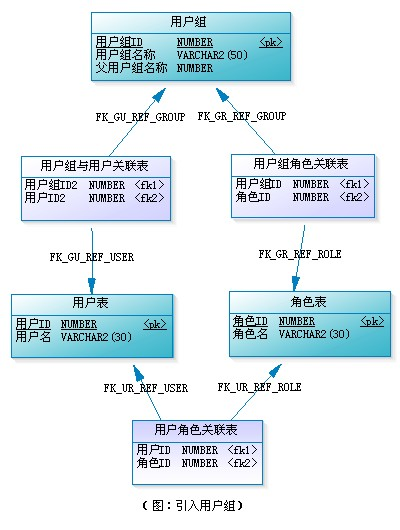
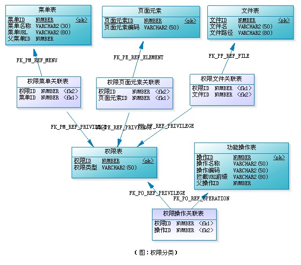
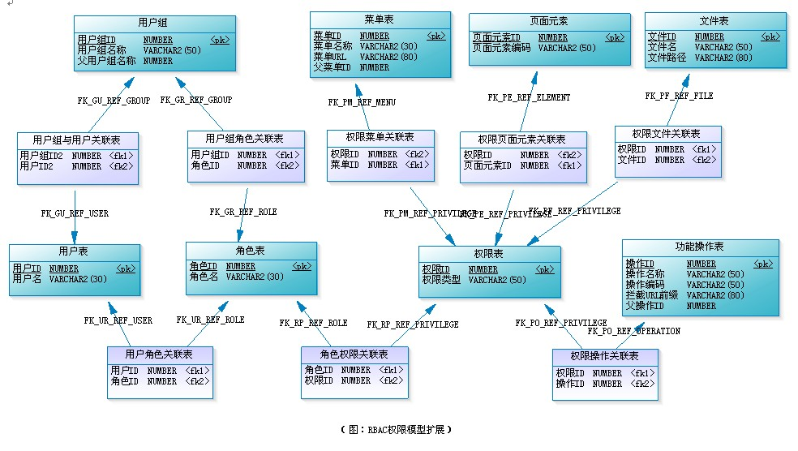
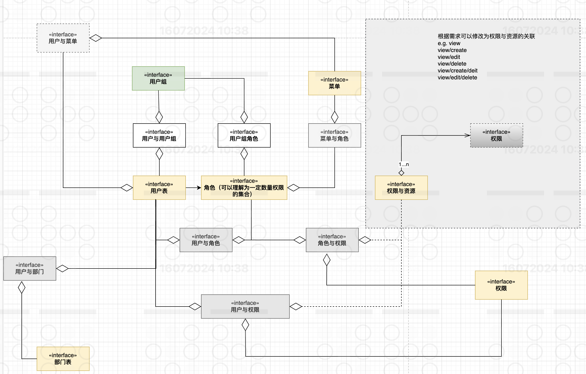
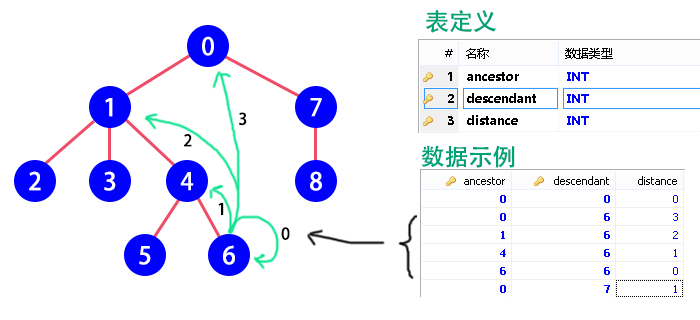

# 一、RBAC权限管理 

RBAC（Role-Based Access Control，基于角色的访问控制），就是用户通过角色与权限进行关联。简单地说，一个用户拥有若干角色，每一个角色拥有若干权限。这样，就构造成“用户-角色-权限”的授权模型。在这种模型中，用户与角色之间，角色与权限之间，一般者是多对多的关系。（如下图）

角色是什么？可以理解为一定数量的权限的集合，权限的载体。例如：一个论坛系统，“超级管理员”、“版主”都是角色。版主可管理版内的帖子、可管理版内的用户等，这些是权限。要给某个用户授予这些权限，不需要直接将权限授予用户，可将“版主”这个角色赋予该用户。 

当用户的数量非常大时，要给系统每个用户逐一授权（授角色），是件非常烦琐的事情。这时，就需要给用户分组，每个用户组内有多个用户。除了可给用户授权外，还可以给用户组授权。这样一来，用户拥有的所有权限，就是用户个人拥有的权限与该用户所在用户组拥有的权限之和。（下图为用户组、用户与角色三者的关联关系）


在应用系统中，权限表现成什么？对功能模块的操作，对上传文件的删改，菜单的访问，甚至页面上某个按钮、某个图片的可见性控制，都可属于权限的范畴。有些权限设计，会把功能操作作为一类，而把文件、菜单、页面元素等作为另一类，这样构成“用户-角色-权限-资源”的授权模型。而在做数据表建模时，可把功能操作和资源统一管理，也就是都直接与权限表进行关联，这样可能更具便捷性和易扩展性。（见下图）

请留意权限表中有一列“权限类型”，我们根据它的取值来区分是哪一类权限，如“MENU”表示菜单的访问权限、“OPERATION”表示功能模块的操作权限、“FILE”表示文件的修改权限、“ELEMENT”表示页面元素的可见性控制等。

这样设计的好处有二。其一，不需要区分哪些是权限操作，哪些是资源，（实际上，有时候也不好区分，如菜单，把它理解为资源呢还是功能模块权限呢？）。其二，方便扩展，当系统要对新的东西进行权限控制时，我只需要建立一个新的关联表“权限XX关联表”，并确定这类权限的权限类型字符串。

这里要注意的是，权限表与权限菜单关联表、权限菜单关联表与菜单表都是一对一的关系。（文件、页面权限点、功能操作等同理）。也就是每添加一个菜单，就得同时往这三个表中各插入一条记录。这样，可以不需要权限菜单关联表，让权限表与菜单表直接关联，此时，须在权限表中新增一列用来保存菜单的ID，权限表通过“权限类型”和这个ID来区分是种类型下的哪条记录。

到这里，RBAC权限模型的扩展模型的完整设计图如下：


最终完善之后的RBAC权限模型完整设计如下：




随着系统的日益庞大，为了方便管理，可引入角色组对角色进行分类管理，跟用户组不同，角色组不参与授权。例如：某系统的权限管理模块中，角色就是挂在区局下，而区局在这里可当作角色组，它不参于权限分配。另外，为方便上面各主表自身的管理与查找，可采用树型结构，如菜单树、功能树等，当然这些可不需要参于权限分配。


参考文章：

- [深入浅出RBAC权限设计](https://www.woshipm.com/pd/5576757.html)


# 二、基于ClosureTable的数据库无限级分类存储实现。
基于ClosureTable的数据库无限级分类存储实现。

ClosureTable以一张表存储节点之间的关系、其中包含了任何两个有关系（祖先与子代）节点的关联信息。其包含3个字段：
- `ancestor` 祖先：祖先节点的id
- `descendant` 子代：子代节点的id
- `distance` 距离：子代到祖先中间隔了几代

ClosureTable能够很好地解决树结构在关系数据库中的查询需求。

```java
import lombok.RequiredArgsConstructor;
import org.apache.ibatis.exceptions.PersistenceException;

/**
 * 分类存储，提供对分类的增删改查等操作的支持。
 * <p>
 * 类别（分类）是用于归类、整理文章资源的数据信息。
 * 每个分类都可以拥有若干子分类，但最多只能属于一个父分类，没有父分类的称为
 * 顶级分类。分类的从属关系可以看做一棵多叉数。
 * <p>
 * 除了相互之间的关系外，分类拥有ID、名称这两个属性。其中ID为int，
 * 由数据库自动生成，你也可以添加其它属性。
 * <p>
 * 分类树有一个根节点，其ID为0，且不可修改ID、移动和删除。
 *
 * @author Kaciras
 */
@RequiredArgsConstructor
public class Repository {

	private final CategoryMapper categoryMapper;

	/**
	 * 根据指定的id，获取分类的全部属性。
	 *
	 * @param id 分类id
	 * @return 分类的实体对象
	 * @throws IllegalArgumentException 如果id不是正数
	 */
	public Category findById(int id) {
		Utils.checkNotNegative(id, "id");
		return categoryMapper.selectAttributes(id);
	}

	/**
	 * 获取所有分类的数量。
	 *
	 * @return 数量
	 */
	public int count() {
		return categoryMapper.selectCount() - 1;
	}

	/**
	 * 获取某一级分类的数量，参数从1开始，表示第一级分类（根分类的子类）。
	 *
	 * @param layer 层级（从1开始）
	 * @return 数量
	 * @throws IllegalArgumentException 如果layer不是正数
	 */
	public int countOfLayer(int layer) {
		Utils.checkPositive(layer, "layer");
		return categoryMapper.selectCountByLayer(layer);
	}

	/**
	 * 新增一个分类，其ID属性将自动生成或计算，并返回。
	 * 新增分类的继承关系由parent属性指定，parent为0表示该分类为一级分类。
	 *
	 * @param category 分类实体对象
	 * @param parent   上级分类id
	 * @throws IllegalArgumentException 如果parent所指定的分类不存在、category为null或category中存在属性为null
	 */
	public int add(Category category, int parent) {
		Utils.checkNotNegative(parent, "parent");
		if (parent > 0 && categoryMapper.contains(parent) == null) {
			throw new IllegalArgumentException("指定的上级分类不存在");
		}
		try {
			categoryMapper.insert(category);
			categoryMapper.insertPath(category.getId(), parent);
			categoryMapper.insertNode(category.getId());
		} catch (PersistenceException ex) {
			throw new IllegalArgumentException(ex);
		}
		return category.getId();
	}

	/**
	 * 该方法仅更新分类的属性，不修改继承关系，若要移动节点请使用
	 * <code>Category.moveTo()</code>和<code>Category.moveTreeTo()</code>
	 *
	 * @param category 新的分类信息对象
	 */
	public void update(Category category) {
		try {
			Utils.checkEffective(categoryMapper.update(category));
		} catch (PersistenceException ex) {
			throw new IllegalArgumentException(ex);
		}
	}

	/**
	 * 删除一个分类，原来在该分类下的子分类将被移动到该分类的父分类中，
	 * 如果此分类是一级分类，则删除后子分类将全部成为一级分类。
	 * <p>
	 * 顶级分类不可删除。
	 *
	 * @param id 要删除的分类的id
	 * @throws IllegalArgumentException 如果指定id的分类不存在
	 */
	public void delete(int id) {
		Utils.checkPositive(id, "id");

		if (categoryMapper.contains(id) == null) {
			throw new IllegalArgumentException("指定的分类不存在");
		}
		Integer parent = categoryMapper.selectAncestor(id, 1);
		if (parent == null) {
			parent = 0;
		}
		findById(id).moveSubTree(parent);
		deleteBoth(id);
	}

	/**
	 * 删除一个分类及其所有的下级分类。
	 * <p>
	 * 顶级分类不可删除。
	 *
	 * @param id 要删除的分类的id
	 * @throws IllegalArgumentException 如果指定id的分类不存在
	 */
	public void deleteTree(int id) {
		Utils.checkPositive(id, "id");

		if (categoryMapper.contains(id) == null) {
			throw new IllegalArgumentException("指定的分类不存在");
		}
		deleteBoth(id);
		for (int des : categoryMapper.selectDescendantId(id)) {
			deleteBoth(des);
		}
	}

	/**
	 * 删除一个分类，两个表中的相关记录都删除
	 *
	 * @param id 分类id
	 */
	private void deleteBoth(int id) {
		Utils.checkEffective(categoryMapper.delete(id));
		categoryMapper.deletePath(id);
	}
}
```

[参考文章](https://segmentfault.com/a/1190000014284076)
