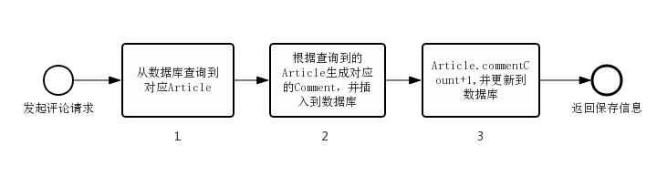
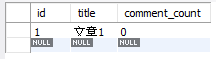
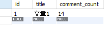
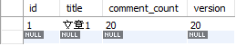
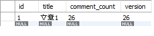

# Spring Boot+SQL/JPA实战悲观锁和乐观锁

公司业务就是最常见的“订单+账户”问题，在解决完公司问题后，转头一想，我的博客项目中也有同样的问题(虽然访问量根本完全不需要考虑并发问题...)，那我就拿这个来举例好了。

## 数据库设计

对于一个有评论功能的博客系统来说，通常会有两个表：1.文章表 2.评论表。其中文章表除了保存一些文章信息等，还有个字段保存评论数量。我们设计一个最精简的表结构来还原该业务场景。

### article 文章表

|字段|类型|备注|
|:----:|:----:|:----:|
|id |INT| 自增主键id|
|title |VARCHAR| 文章标题|
|comment_count| INT| 文章的评论数量|

### comment 评论表

|字段|类型|备注|
|:----:|:----:|:----:|
|id |INT| 自增主键id|
|article_id| INT| 评论的文章id|
|content |VARCHAR |评论内容|

当一个用户评论的时候，1. 根据文章id获取到文章 2. 插入一条评论记录 3. 该文章的评论数增加并保存

### 代码实现

1. 首先在引入对应的依赖

```gradle
    implementation "org.springframework.boot:spring-boot-starter-web"
    implementation "org.springframework.boot:spring-boot-starter-data-jpa"
    implementation 'org.springframework:spring-aspects'
    implementation 'org.springframework.retry:spring-retry'
```

2. 然后编写对应数据库的实体类

```java
@Data
@Entity
public class Article {
    @Id
    @GeneratedValue(strategy = GenerationType.IDENTITY)
    private Long id;
    private String title;
    private Long commentCount;
}

@Data
@Entity
public class Comment {
    @Id
    @GeneratedValue(strategy = GenerationType.IDENTITY)
    private Long id;
    private Long articleId;
    private String content;
}
```

3. 接着创建这两个实体类对应的Repository，由于spring-jpa-data的CrudRepository已经帮我们实现了最常见的CRUD操作，所以我们的Repository只需要继承CrudRepository接口其他啥都不用做。

```java
public interface ArticleRepository extends CrudRepository<Article, Long> {
}
public interface CommentRepository extends CrudRepository<Comment, Long> {
}
```

4. 接着我们就简单的实现一下Controller接口和Service实现类。

```java
@Slf4j
@RestController
public class CommentController {
    @Autowired
    private CommentService commentService;
    @PostMapping("comment")
    public String comment(Long articleId, String content) {
        try {
            commentService.postComment(articleId, content);
        } catch (Exception e) {
            log.error("{}", e);
            return "error: " + e.getMessage();
        }
        return "success";
    }
}
@Slf4j
@Service
public class CommentService {
    @Autowired
    private ArticleRepository articleRepository;
    @Autowired
    private CommentRepository commentRepository;
    public void postComment(Long articleId, String content) {
        Optional<Article> articleOptional = articleRepository.findById(articleId);
        if (!articleOptional.isPresent()) {
            throw new RuntimeException("没有对应的文章");
        }
        Article article = articleOptional.get();
        Comment comment = new Comment();
        comment.setArticleId(articleId);
        comment.setContent(content);
        commentRepository.save(comment);
        article.setCommentCount(article.getCommentCount() + 1);
        articleRepository.save(article);
    }
}
```

### 并发问题分析

从刚才的代码实现里可以看出这个简单的评论功能的流程，当用户发起评论的请求时，从数据库找出对应的文章的实体类`Article`，然后根据文章信息生成对应的评论实体类`Comment`，并且插入到数据库中，接着增加该文章的评论数量，再把修改后的文章更新到数据库中，整个流程如下流程图。



!!!
    在这个流程中有个问题，当有多个用户同时并发评论时，他们同时进入步骤1中拿到Article，然后插入对应的Comment，最后在步骤3中更新评论数量保存到数据库。**只是由于他们是同时在步骤1拿到的Article，所以他们的Article.commentCount的值相同，那么在步骤3中保存的Article.commentCount+1也相同，那么原来应该+3的评论数量，只加了1。**

我们用测试用例代码试一下

```java
@SpringBootTest(classes = LockAndTransactionApplication.class, webEnvironment = SpringBootTest.WebEnvironment.RANDOM_PORT)
public class CommentControllerTests {
    @Autowired
    private TestRestTemplate testRestTemplate;
    @Test
    public void concurrentComment() {
        String url = "http://localhost:9090/comment";
        for (int i = 0; i < 100; i++) {
            int finalI = i;
            new Thread(() -> {
                MultiValueMap<String, String> params = new LinkedMultiValueMap<>();
                params.add("articleId", "1");
                params.add("content", "测试内容" + finalI);
                String result = testRestTemplate.postForObject(url, params, String.class);
            }).start();
        }
    }
}
```

这里我们开了100个线程，同时发送评论请求，对应的文章id为1。

在发送请求前，数据库数据为

```sql
select * from article
```



```sql
select count(*) comment_count from comment
```


发送请求后，数据库数据为

```sql
select* from article
```



```sql
select count(*) comment_count from comment
```


明显的看到在article表里的comment_count的值不是100，这个值不一定是我图里的14，但是必然是不大于100的，而comment表的数量肯定等于100。

这就展示了在文章开头里提到的并发问题，这种问题其实十分的常见，只要有类似上面这样评论功能的流程的系统，都要小心避免出现这种问题。

!!!
    下面就用实例展示展示如何通过悲观锁和乐观锁防止出现并发数据问题，同时给出SQL方案和JPA自带方案，SQL方案可以通用“任何系统”，甚至不限语言，而JPA方案十分快捷，如果你恰好用的也是JPA，那就可以简单的使用上乐观锁或悲观锁。最后也会根据业务比较一下乐观锁和悲观锁的一些区别

### 悲观锁解决并发问题

悲观锁顾名思义就是悲观的认为自己操作的数据都会被其他线程操作，所以就必须自己独占这个数据，可以理解为”独占锁“。在java中`synchronized`和`ReentrantLock`等锁就是悲观锁，数据库中表锁、行锁、读写锁等也是悲观锁。

### 利用SQL解决并发问题

行锁就是操作数据的时候把这一行数据锁住，其他线程想要读写必须等待，但同一个表的其他数据还是能被其他线程操作的。只要在需要查询的sql后面加上`for update`，就能锁住查询的行，**特别要注意查询条件必须要是索引列，如果不是索引就会变成表锁，把整个表都锁住**。

现在在原有的代码的基础上修改一下，先在ArticleRepository增加一个手动写sql查询方法。

```java
public interface ArticleRepository extends CrudRepository<Article, Long> {
@Query(value = "select* from article a where a.id = :id for update", nativeQuery = true)
    Optional<Article> findArticleForUpdate(Long id);
}
```

然后把`CommentService`中使用的查询方法由原来的findById改为我们自定义的方法

```java
public class CommentService {
    ...

    public void postComment(Long articleId, String content) {
        // Optional<Article> articleOptional = articleRepository.findById(articleId);
        Optional<Article> articleOptional = articleRepository.findArticleForUpdate(articleId);
    
        ...
    }
}
```

这样我们查出来的`Article`，**在我们没有将其提交事务之前，其他线程是不能获取修改的**，保证了同时只有一个线程能操作对应数据。

现在再用测试用例测一下，`article.comment_count`的值必定是100。

### 利用JPA自带行锁解决并发问题

对于刚才提到的在sql后面增加`for update`，JPA有提供一个更优雅的方式，就是`@Lock`注解，这个注解的参数可以传入想要的锁级别。

现在在`ArticleRepository`中增加JPA的锁方法，其中`LockModeType.PESSIMISTIC_WRITE`参数就是行锁。

```java
public interface ArticleRepository extends CrudRepository<Article, Long> {
    ...

    @Lock(value = LockModeType.PESSIMISTIC_WRITE)
    @Query("select a from Article a where a.id = :id")
    @QueryHints({@QueryHint(name = "javax.persistence.lock.timeout", value = "5000")}) // 此处可以添加超时设置，如果超时，会抛出
    Optional<Article> findArticleWithPessimisticLock(Long id);
}
```

同样的只要在`CommentService`里把查询方法改为`findArticleWithPessimisticLock()`，再测试用例测一下，肯定不会有并发问题。而且这时看一下控制台打印信息，发现实际上查询的sql还是加了`for update`，只不过是JPA帮我们加了而已。

```log
Hibernate: select commentdo0_.comm_id as comm_id1_8_, commentdo0_.active as active2_8_, commentdo0_.created_time as created_3_8_, commentdo0_.updated_time as updated_4_8_, commentdo0_.version as version5_8_, commentdo0_.comm_blog_id as comm_blo6_8_, commentdo0_.comm_b_id as comm_b_i7_8_, commentdo0_.comm_content as comm_con8_8_, commentdo0_.comm_likes as comm_lik9_8_, commentdo0_.comm_parent_id as comm_pa10_8_, commentdo0_.comm_time as comm_ti11_8_ from ethan_comment commentdo0_ where commentdo0_.comm_id=? for update
```

如果添加了超时配置，并且更新超时，会抛出异常

```log
ERROR [,44307e7c856d4433,746b50a051950925] 24608 --- [Asy-30] o.h.engine.jdbc.spi.SqlExceptionHelper   : (conn=418) Lock wait timeout exceeded; try restarting transaction
ERROR [,584fb77990c35cf0,15a721ac95d89756] 24608 --- [Asy-38] c.ethan.service.impl.CommentServiceImpl  : Asy-38 update error
```

### 乐观锁解决并发问题

乐观锁顾名思义就是特别乐观，认为自己拿到的资源不会被其他线程操作所以不上锁，只是在插入数据库的时候再判断一下数据有没有被修改。所以悲观锁是限制其他线程，而乐观锁是限制自己，虽然他的名字有锁，但是实际上不算上锁，只是在最后操作的时候再判断具体怎么操作。

> 乐观锁通常为版本号机制或者CAS算法

**利用SQL实现版本号解决并发问题**

!!!
    **版本号机制就是在数据库中加一个字段当作版本号，比如我们加个字段version。那么这时候拿到`Article`的时候就会带一个版本号，比如拿到的版本是1，然后你对这个`Article`一通操作，操作完之后要插入到数据库了。发现哎呀，怎么数据库里的`Article`版本是2，和我手里的版本不一样啊，说明我手里的`Article`不是最新的了，那么就不能放到数据库了。这样就避免了并发时数据冲突的问题。**

所以我们现在给article表加一个字段version

**article 文章表**
|字段| 类型| 备注|
|:---:|:---:|:---:|
|version| INT DEFAULT 0| 版本号|

然后对应的实体类也增加version字段

```java
@Data
@Entity
public class Article {
    ...

    private Long version;
}
```

接着在`ArticleRepository`增加更新的方法，注意这里是更新方法，和悲观锁时增加查询方法不同。

```java
public interface ArticleRepository extends CrudRepository<Article, Long> {
    @Modifying
    @Query(value = "update article set comment_count = :commentCount, version = version + 1 where id = :id and version = :version", nativeQuery = true)
    int updateArticleWithVersion(Long id, Long commentCount, Long version);
}
```

可以看到update的where有一个判断version的条件，并且会set version = version + 1。这就保证了只有当数据库里的版本号和要更新的实体类的版本号相同的时候才会更新数据。

接着在`CommentService`里稍微修改一下代码。

```java
// CommentService
public void postComment(Long articleId, String content) {
    Optional<Article> articleOptional = articleRepository.findById(articleId);
    ...
    int count = articleRepository.updateArticleWithVersion(article.getId(), article.getCommentCount() + 1, article.getVersion());
    if (count == 0) {
        throw new RuntimeException("服务器繁忙,更新数据失败");
    }
    // articleRepository.save(article);
}
```

首先对于`Article`的查询方法只需要普通的`findById()`方法就行不用上任何锁。

然后更新`Article`的时候改用新加的`updateArticleWithVersion()`方法。可以看到这个方法有个返回值，这个返回值代表更新了的数据库行数，如果值为0的时候表示没有符合条件可以更新的行。

这之后就可以由我们自己决定怎么处理了，**这里是直接回滚，spring就会帮我们回滚之前的数据操作，把这次的所有操作都取消以保证数据的一致性**。

现在再用测试用例测一下

```sql
select *from article
```



```sql
select count(*) comment_count from comment
```


现在看到`Article`里的`comment_count`和`Comment`的数量都不是100了，**但是这两个的值必定是一样的了**。因为刚才我们处理的时候假如`Article`表的数据发生了冲突，那么就不会更新到数据库里，这时抛出异常使其事务回滚，这样就能保证没有更新`Article`的时候`Comment`也不会插入，就解决了数据不统一的问题。

这种直接回滚的处理方式用户体验比较差，通常来说如果判断`Article`更新条数为0时，会尝试重新从数据库里查询信息并重新修改，再次尝试更新数据，如果不行就再查询，直到能够更新为止。当然也不会是无线的循环这样的操作，会设置一个上线，比如循环3次查询修改更新都不行，这时候才会抛出异常。

### 利用JPA实现版本现解决并发问题

JPA对悲观锁有实现方式，乐观锁自然也是有的，现在就用JPA自带的方法实现乐观锁。

首先在`Article`实体类的version字段上加上`@Version`注解，我们进注解看一下源码的注释，可以看到有部分写到:

> The following types are supported for version properties: int, Integer, short, Short, long, Long, java.sql.Timestamp.

注释里面说版本号的类型支持int, short, long三种基本数据类型和他们的包装类以及Timestamp，我们现在用的是Long类型。

```java
@Data
@Entity
public class Article {
    ...

    @Version
    private Long version;
}
```

接着只需要在`CommentService`里的评论流程修改回我们最开头的“会触发并发问题”的业务代码就行了。说明JPA的这种乐观锁实现方式是非侵入式的。

```java
// CommentService
public void postComment(Long articleId, String content) {
    Optional<Article> articleOptional = articleRepository.findById(articleId);
    ...
    article.setCommentCount(article.getCommentCount() + 1);
    articleRepository.save(article);
}
```

和前面同样的，用测试用例测试一下能否防止并发问题的出现。

```sql
select * from article
```



```sql
select count(*) comment_count from comment
```


同样的Article里的`comment_count`和`Comment`的数量也不是100，但是这两个数值肯定是一样的。看一下IDEA的控制台会发现系统抛出了`ObjectOptimisticLockingFailureException`的异常。

```log
ERROR [,fdf6fe75287bfc08,fdf6fe75287bfc08] 8276 --- [          Asy-9] c.ethan.service.impl.CommentServiceImpl  : Asy-9 update error
org.springframework.orm.ObjectOptimisticLockingFailureException: Batch update returned unexpected row count from update [0]; actual row count: 0; expected: 1; statement executed: update ethan_comment set active=?, created_time=?, updated_time=?, version=?, comm_blog_id=?, comm_b_id=?, comm_content=?, comm_likes=?, comm_parent_id=?, comm_time=? where comm_id=? and version=?; nested exception is org.hibernate.StaleStateException: Batch update returned unexpected row count from update [0]; actual row count: 0; expected: 1; statement executed: update ethan_comment set active=?, created_time=?, updated_time=?, version=?, comm_blog_id=?, comm_b_id=?, comm_content=?, comm_likes=?, comm_parent_id=?, comm_time=? where comm_id=? and version=?
 at org.springframework.orm.jpa.vendor.HibernateJpaDialect.convertHibernateAccessException(HibernateJpaDialect.java:318) ~[spring-orm-5.3.16.jar:5.3.16]
 at org.springframework.orm.jpa.vendor.HibernateJpaDialect.translateExceptionIfPossible(HibernateJpaDialect.java:233) ~[spring-orm-5.3.16.jar:5.3.16]
 ...
Caused by: org.hibernate.StaleStateException: Batch update returned unexpected row count from update [0]; actual row count: 0; expected: 1; statement executed: update ethan_comment set active=?, created_time=?, updated_time=?, version=?, comm_blog_id=?, comm_b_id=?, comm_content=?, comm_likes=?, comm_parent_id=?, comm_time=? where comm_id=? and version=?
 at org.hibernate.jdbc.Expectations$BasicExpectation.checkBatched(Expectations.java:67) ~[hibernate-core-5.6.5.Final.jar:5.6.5.Final]
 ... 32 common frames omitted

```

这和刚才我们自己实现乐观锁类似，如果没有成功更新数据则抛出异常回滚保证数据的一致性。如果想要实现重试流程可以捕获`ObjectOptimisticLockingFailureException`这个异常，通常会利用AOP+自定义注解来实现一个全局通用的重试机制，这里就是要根据具体的业务情况来拓展了，可以引用spring-retry来设置重试次数。

```java
@Retryable(value = { Exception.class }, maxAttempts = 5, backoff = @Backoff(delay = 1000))
public void postComment(Long articleId, String content) {
    try {
        Optional<Article> articleOptional = articleRepository.findById(articleId);
        ...
        article.setCommentCount(article.getCommentCount() + 1);
        articleRepository.save(article);
    } catch (Exception e) {
        // log.error(Thread.currentThread().getName()+" update error", e);
        throw e;
    }    
}

@Recover
public void postCommentFallback(Exception e, Long articleId, String content) {
    log.warn("postCommentFallback with id:{} content:{} and error msg:{}", articleId, content, e.getMessage());
}
```

### 悲观锁和乐观锁比较

- **悲观锁适合写多读少的场景**。因为在使用的时候该线程会独占这个资源，在本文的例子来说就是某个id的文章，如果有大量的评论操作的时候，就适合用悲观锁，否则用户只是浏览文章而没什么评论的话，用悲观锁就会经常加锁，增加了加锁解锁的资源消耗。
- **乐观锁适合写少读多的场景**。由于乐观锁在发生冲突的时候会回滚或者重试，如果写的请求量很大的话，就经常发生冲突，经常的回滚和重试，这样对系统资源消耗也是非常大。
- **所以悲观锁和乐观锁没有绝对的好坏**，必须结合具体的业务情况来决定使用哪一种方式。另外在阿里巴巴开发手册里也有提到：

> 如果每次访问冲突概率小于 20%，推荐使用乐观锁，否则使用悲观锁。乐观锁的重试次
数不得小于 3 次。

阿里巴巴建议以冲突概率20%这个数值作为分界线来决定使用乐观锁和悲观锁，虽然说这个数值不是绝对的，但是作为阿里巴巴各个大佬总结出来的也是一个很好的参考。
