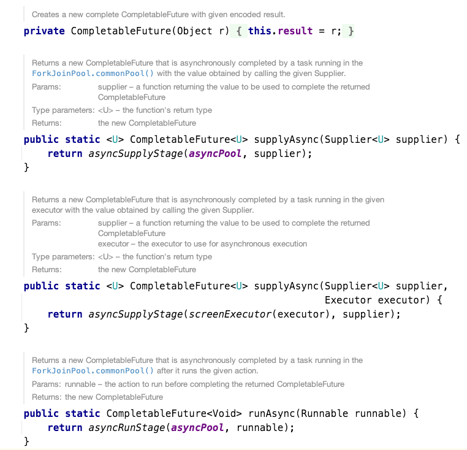
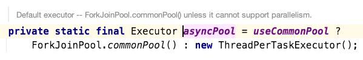
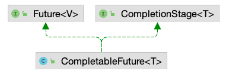
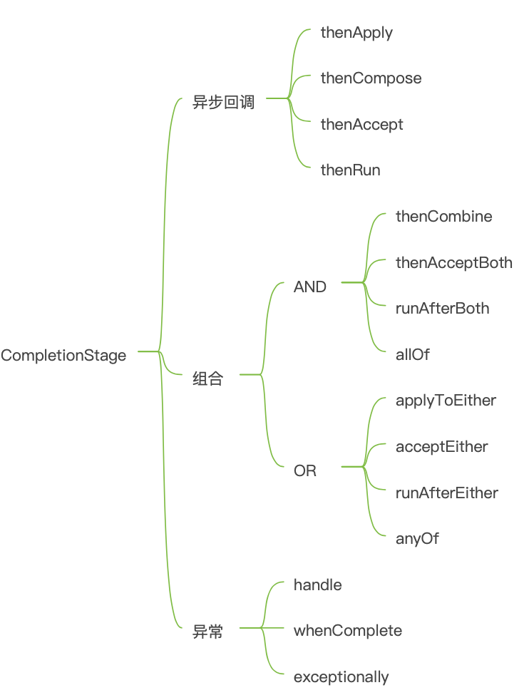

# CompletableFuture异步编程

## 为什么使用CompletableFuture
一些业务场景我们需要使用多线程异步执行任务，加快任务执行速度。 JDK5新增了Future接口，用于描述一个异步计算的结果。虽然 Future 以及相关使用方法提供了异步执行任务的能力，但是对于结果的获取却是很不方便，我们必须使用Future.get的方式阻塞调用线程，或者使用轮询方式判断 Future.isDone 任务是否结束，再获取结果。这两种处理方式都不是很优雅，相关代码如下:

```java
public class Test {
    @Test
    public void testFuture() {
        ExecutorService executorService = Executors.newFixedThreadPool(5);
        Future<String> future = executorService.submit(() -> {
            try {
                Thread.sleep(2000);
            } catch (InterruptedException e) {
                e.printStackTrace();
            }
            return "hello";
        });
        try {
            System.out.println(future.get());
            System.out.println("end");
        } catch (InterruptedException | ExecutionException e) {
            e.printStackTrace();
        }
    }
}
```

此外就是无法解决多个异步任务需要相互依赖的场景，简单点说就是，主线程需要等待子线程任务执行完毕之后在进行执行，这个时候你可能想到了CountDownLatch，没错确实可以解决，代码如下，但是Java8以后我不在认为这是一种优雅的解决方式，接下来我们来了解下CompletableFuture的使用。

```java
public class Test{
    @Test
    public void testCountDownLatch() {
        ExecutorService executorService = Executors.newFixedThreadPool(5);
        CountDownLatch downLatch = new CountDownLatch(2);
        Future<String> orderFuture = executorService.submit(() -> {
            OrderService orderService = new OrderServiceImpl();
            String result = orderService.queryOrderInfo();
            downLatch.countDown();
            return result;
        });
        Future<String> trailFuture = executorService.submit(() -> {
            TrailService trailService = new TrailServiceImpl();
            String result = trailService.queryTrail();
            downLatch.countDown();
            return result;
        });
        try {
            downLatch.await();
        } catch (InterruptedException e) {
            e.printStackTrace();
        }
        try {
            System.out.println(orderFuture.get() + trailFuture.get());
            System.out.println("end");
        } catch (InterruptedException | ExecutionException e) {
            e.printStackTrace();
        }
    }
}    
```
## 使用介绍
### 创建实例



关于CompletableFuture的创建提供了5种方式，第一个就是创建一个具有默认结果的 CompletableFuture，不经常使用，我们常用就是runAsync和supplyAsync，重点关注下这两个静态方法。runAsync是不具有返回值，supplyAsync具有返回值，关于这两个方法都提供一个两种创建形式，一种是默认的使用公共的 ForkJoinPool 线程池执行，这个线程池默认线程数是 CPU 的核数。



另外一种使用就是提供一个主动创建线程池，这样做相比于ForkJoinPool的好处是，可以通过自定义不同场景的线程池，来进行业务划分方便发现问题，还有一个好处就是对于ForkJoinPool这种共享线程来说，一旦阻塞，会照成其他线程无法获取执行机会。

### CompletionStage


关于CompletableFuture核心能力就是通过继承**Future**和**CompletionStage**来实现的，关于Future就是提供一些异步的能力，如果单存就这样CompletableFuture也就不会那么强大，所以我们核心就是介绍CompletionStage内部常用一些方法。



关于CompletionStage的方法，可以分为两种类型的接口，其中核心方法都提供异步的方式，这里关于异步的方法不进行介绍，基本上原理类似，都是新提供一个线程池去实现任务。

### 异步回调
关于异步回调可以分为两类，一种是有参数的返回，另外一种是无参数的返回，有参数返回的包括thenApply和thenCompose，无参数返回的包括thenRun和thenAccept。

#### 有参数返回
thenApply 和 thenCompose表示某个任务执行完成后执行的动作，即回调方法，会将该任务的执行结果即方法返回值作为入参传递到回调方法中，也可以理解为串行化的，唯一不同的是thenCompose需要返回一个新的 CompletionStage，整体的使用如下:

```java
    @Test
    public void testCompletableFuture() {
        long start = System.currentTimeMillis();
        CompletableFuture<String> first = CompletableFuture.supplyAsync(() -> {
            try {
                Thread.sleep(1000);
            } catch (InterruptedException e) {
                e.printStackTrace();
            }
            return "aaaaaaaaaaaaaaaaaaaaa";
        }).thenApply(x -> {
            try {
                Thread.sleep(1000);
            } catch (InterruptedException e) {
                e.printStackTrace();
            }
            return x + "bbbbbbbbbbbbbbbbbbbbbbbb";
        }).thenCompose(x -> CompletableFuture.supplyAsync(x::toUpperCase));
        System.out.println(first.join());
        long end = System.currentTimeMillis();
        System.out.println("耗时" + (end - start) / 1000 + "");
    }

@Test
public void testCompletableFutureThenCompose(){
        Double balance=this.doFindAccountNumber()
        .thenCompose(this::doCalculateBalance)
        .thenCompose(this::doSendNotifyBalance).join();
        assertEquals(9527D,balance);
}
private CompletableFuture<Double> doSendNotifyBalance(Double aDouble){
        sleepSeconds(2);
        // business code
        System.out.println(String.format("%s doSendNotifyBalance ....",Thread.currentThread().getName()));
        return CompletableFuture.completedFuture(9527D);
}
private CompletableFuture<Double> doCalculateBalance(Double d){
        sleepSeconds(2);
        // business code
        System.out.println(String.format("%s doCalculateBalance ....",Thread.currentThread().getName()));
        return CompletableFuture.completedFuture(9527D);
}
private CompletableFuture<Double> doFindAccountNumber(){
        sleepSeconds(2);
        // business code
        System.out.println(String.format("%s doFindAccountNumber ....",Thread.currentThread().getName()));
        return CompletableFuture.completedFuture(9527D);
}
private void sleepSeconds(int timeout){
        try{
            TimeUnit.SECONDS.sleep(timeout);
        }catch(InterruptedException e){
            e.printStackTrace();
        }
}
```

#### 无参数返回
thenAccept也是消费上一个任务的动作，将该任务的执行结果即方法返回值作为入参传递到回调方法中，只是无返回值，thenAccep与thenRun方法不同就是没有入参也没有返回值。

```java
@Test
    public void testCompletableFuture() {
        long start = System.currentTimeMillis();
        CompletableFuture<Void> first = CompletableFuture.supplyAsync(() -> {
            try {
                Thread.sleep(1000);
            } catch (InterruptedException e) {
                e.printStackTrace();
            }
            return "a";
        }).thenAccept(x -> {
            System.out.println(x);
        });
        first.join();
        long end = System.currentTimeMillis();
        System.out.println("耗时" + (end - start) / 1000 + "秒");
    }
```

#### 链式调用和结果聚合处理
我们知道 `CompletableFuture` 的 `get()` 方法会一直阻塞直到获取到结果，`CompletableFuture` 提供了 `thenApply`、`thenAccept` 和 `thenRun` 等方法来避免这种情况，而且我们还可以添加任务完成后的回调通知。这几个方法的使用场景如下：
- **thenApply** 当我们如果要在从 Future 接收值后任务之前运行自定义的业务代码，然后要为此任务返回一些值时，则可以使用该方法
- **thenAccept** 如果我们希望在从 Future 接收到一些值后执行任务之前运行自定义的业务代码而不关心返回结果值时，则可以使用该方法
- **thenRun** 如果我们想在Future完成后运行自定义的业务代码，并且不想为此返回任何值时，则可以使用该方法

```java
@Test
public void testCompletableFutureThenApply() {
    Integer notificationId = CompletableFuture.supplyAsync(this::thenApplyProcess)
        .thenApply(this::thenApplyNotify) // Non Blocking
        .join();
    assertEquals(new Integer(1), notificationId);
}
@Test
public void testCompletableFutureThenAccept() {
    CompletableFuture.supplyAsync(this::processVariable)
        .thenAccept(this::thenAcceptNotify) // Non Blocking
        .join();
    assertEquals(100, variable.get());
}
@Test
public void testCompletableFutureThenRun() {
    CompletableFuture.supplyAsync(this::processVariable)
        .thenRun(this::thenRunNotify)
        .join();
    assertEquals(100, variable.get());
}
private String processVariable() {
    variable.set(100);
    return "success";
}
private void thenRunNotify() {
    System.out.println("thenRun completed notify ....");
}
private Integer thenApplyNotify(Integer integer) {
    return integer;
}
private void thenAcceptNotify(String s) {
    System.out.println(
    String.format("Thread %s completed notify ....", Thread.currentThread().getName()));
}
public Integer thenApplyProcess() {
    return 1;
}
```

如果有大量的异步计算，那么我们可以继续将值从一个回调传递到另一个回调中去，也就是使用链式调用方式，使用方式很简单。

```java
@Test
public void testCompletableFutureThenApplyAccept() {
    CompletableFuture.supplyAsync(this::findAccountNumber)
        .thenApply(this::calculateBalance)
        .thenApply(this::notifyBalance)
        .thenAccept((i) -> notifyByEmail()).join();
}
private void notifyByEmail() {
    // business code
    System.out.println("send notify by email ...");
}
private Double notifyBalance(Double d) {
    // business code
    System.out.println(String.format("your balance is $%s", d));
    return 9527D;
}
private Double calculateBalance(Object o) {
    // business code
    return 9527D;
}
private Double findAccountNumber() {
    // business code
    return 9527D;
}
```

比较细心的朋友可能注意到在所有前面的几个方法示例中，所有方法都是在同一线程上执行的。如果我们希望这些任务在单独的线程上运行时，那么我们可以使用这些方法对应的异步版本。

```java
@Test
public void testCompletableFutureApplyAsync(){
        ExecutorService newFixedThreadPool=Executors.newFixedThreadPool(2);
        ScheduledExecutorService newSingleThreadScheduledExecutor=Executors
        .newSingleThreadScheduledExecutor();
        CompletableFuture<Double> completableFuture=
        CompletableFuture
        .supplyAsync(this::findAccountNumber,
        newFixedThreadPool) // 从线程池 newFixedThreadPool 获取线程执行任务
        .thenApplyAsync(this::calculateBalance,
        newSingleThreadScheduledExecutor)
        .thenApplyAsync(this::notifyBalance);
        Double balance=completableFuture.join();
        assertEquals(9527D,balance);
}
```


#### 异常

CompletableFuture方法执行过程若产生异常，只有get或者join方法的才能获取到异常，针对这种情况CompletableFuture提供三种处理异常的方式。

#### exceptionally

exceptionally的使用方式类似于 try catch中的catch代码块中异常处理。exceptionally当某个任务执行异常时执行的回调方法，将抛出的异常作为参数传递到回调方法中，如果该任务正常执行，exceptionally方法返回的CompletionStage的result就是该任务正常执行的结果。

```java
 @Test
    public void testCompletableFuture() {
        long start = System.currentTimeMillis();
        CompletableFuture<String> first = CompletableFuture.supplyAsync(() -> {
            try {
                Thread.sleep(1000);
            } catch (InterruptedException e) {
                e.printStackTrace();
            }
            throw new RuntimeException("test");
        });
        CompletableFuture<String> two = first.exceptionally((x) -> {
            x.printStackTrace();
            return "123";
        });
        two.join();
        long end = System.currentTimeMillis();
        System.out.println("耗时" + (end - start) / 1000 + "秒");
    }
```

#### whenComplete
whenComplete的使用类似于 try..catch..finanlly 中 finally 代码块，无论是否发生异常，都将会执行的。whenComplete当某个任务执行完成后执行的回调方法，会将执行结果或者执行期间抛出的异常传递给回调方法，如果是正常执行则异常为null，回调方法对应的CompletableFuture的result和该任务一致，如果该任务正常执行，则get方法返回执行结果，如果是执行异常，则get方法抛出异常。

```java
@Test
    public void testCompletableFuture() {
        long start = System.currentTimeMillis();
        CompletableFuture<String> first = CompletableFuture.supplyAsync(() -> {
            try {
                Thread.sleep(1000);
            } catch (InterruptedException e) {
                e.printStackTrace();
            }
            return "aa";
        }).whenComplete((x, throwable) -> {
            // 如果异常存在,打印异常，并且返回默认值
            if (throwable != null) {
                throwable.printStackTrace();
                System.out.println("失败");
            } else {
                System.out.println("成功");
            }
        });
        System.out.println(first.join());
        long end = System.currentTimeMillis();
        System.out.println("耗时" + (end - start) / 1000 + "秒");
    }
```

#### handle
跟whenComplete基本一致，区别在于handle的回调方法有返回值，且handle方法返回的CompletableFuture的result是回调方法的执行结果或者回调方法执行期间抛出的异常，与原始CompletableFuture的result无关。

```java
@Test
    public void testCompletableFuture() {
        long start = System.currentTimeMillis();
        CompletableFuture<String> first = CompletableFuture.supplyAsync(() -> {
            try {
                Thread.sleep(1000);
            } catch (InterruptedException e) {
                e.printStackTrace();
            }
            throw new RuntimeException("test");
        }).handle((x, throwable) -> {
            // 如果异常存在,打印异常，并且返回默认值
            if (throwable != null) {
                throwable.printStackTrace();
                return "异常";
            } else {
                
                return x + "aa";
            }
        });
        System.out.println(first.join());
        long end = System.currentTimeMillis();
        System.out.println("耗时" + (end - start) / 1000 + "秒");
    }
```

### 组合关系
组合关系关系分为两种，一种是和的关系，一种是或的关系，和关系就是当所有的任务执行完成以后再继续执行，类似于CountDownLatch，或关系就是只要有一个任务执行完成以后就可以向下执行。

#### 和关系
**thenCombine /thenAcceptBoth / runAfterBoth/allOf**

这四个方法可以将多个CompletableFuture组合起来，将多个CompletableFuture都执行完成以后，才能执行后面的操作，区别在于，thenCombine会将任务的执行结果作为方法入参传递到指定方法中，且该方法有返回值；thenAcceptBoth同样将任务的执行结果作为方法入参，但是无返回值；runAfterBoth没有入参，也没有返回值。注意多个任务中只要有一个执行异常，则将该异常信息作为指定任务的执行结果。allOf是多个任务都执行完成后才会执行，只要有一个任务执行异常，则返回的CompletableFuture执行get方法时会抛出异常，如果都是正常执行，则get返回null。

```java
@Test
    public void testCompletableFuture() {
        CompletableFuture<String> order = CompletableFuture.supplyAsync(() -> {
            OrderService orderService = new OrderServiceImpl();
            return orderService.queryOrderInfo();
        });
        CompletableFuture<String> trail = CompletableFuture.supplyAsync(() -> {
            TrailService trailService = new TrailServiceImpl();
            return trailService.queryTrail();
        });
        CompletableFuture<String> future = order.thenCombine(trail, (a, b) -> a + b);
        CompletableFuture<Void> afterBoth = future.runAfterBoth(trail, () -> {
            System.out.println(future.join());
        });
        CompletableFuture<Void> result = CompletableFuture.allOf(afterBoth);
        try {
            System.out.println(result.get());
        } catch (InterruptedException | ExecutionException e) {
            e.printStackTrace();
        }
    }

@Test
public void testCompletableFutureAllof() {
        List<CompletableFuture<String>> list = Lists.newArrayListWithCapacity(4);
        IntStream.range(0, 3).forEach(num -> list.add(findName(num)));
        CompletableFuture<Void> allFuture = CompletableFuture
        .allOf(list.toArray(new CompletableFuture[0]));
        CompletableFuture<List<String>> allFutureList = allFuture
        .thenApply(val -> list.stream().map(CompletableFuture::join).collect(Collectors.toList()));
        CompletableFuture<String> futureHavingAllValues = allFutureList
        .thenApply(fn -> String.join("", fn));
        String result = futureHavingAllValues.join();
        assertEquals("mghio0mghio1mghio2", result);
}
private CompletableFuture<String> findName(int num) {
        return CompletableFuture.supplyAsync(() -> {
            sleepSeconds(2);
            // business code
            return "mghio" + num;
        });
}
```

#### 或关系
**applyToEither / acceptEither / runAfterEither/anyOf**

这四个方法可以将多个CompletableFuture组合起来，只需要其中一个CompletableFuture执行完成以后，就能执行后面的操作，applyToEither会将已经执行完成的任务的执行结果作为方法入参，并有返回值；acceptEither同样将已经执行完成的任务的执行结果作为方法入参，但是没有返回值；runAfterEither没有方法入参，也没有返回值，注意多个任务中只要有一个执行异常，则将该异常信息作为指定任务的执行结果

```java
 @Test
    public void testCompletableFuture() {
        CompletableFuture<String> order = CompletableFuture.supplyAsync(() -> {
            OrderService orderService = new OrderServiceImpl();
            return orderService.queryOrderInfo();
        });
        CompletableFuture<String> trail = CompletableFuture.supplyAsync(() -> {
            TrailService trailService = new TrailServiceImpl();
            return trailService.queryTrail();
        });
        CompletableFuture<String> future = order.applyToEither(trail, (result) -> result);
        CompletableFuture<Void> afterBoth = future.runAfterEither(trail, () -> {
            System.out.println(future.join());
        });
        CompletableFuture<Object> result = CompletableFuture.anyOf(afterBoth,order);
        try {
            System.out.println(result.get());
        } catch (InterruptedException | ExecutionException e) {
            e.printStackTrace();
        }
    }
```

## 项目中如何使用
CompletableFuture在自定义线程时，默认使用的线程池是 ForkJoinPool.commonPool()，对于我们用java常做的IO密集型任务，默认线程池是远远不够使用的；在双核及以下机器上，默认线程池又会退化为为每个任务创建一个线程，相当于没有线程池。因此对于CompletableFuture在项目中的使用一定要自定义线程池，同时又要注意自定义线程池，线程池有个容量满了的拒绝策略，如果采用丢弃策略的拒绝策略，并且allOf方法和get方法如果没有设置超时则会无限期的等待下去，接下来我们通过自定义线程使用CompletableFuture。
1. 自定义线程池，此处通过继承ThreadPoolExecutor，重写了shutdown() 、shutdownNow() 、beforeExecute() 和 afterExecute()方法来统计线程池的执行情况，此处还可以结合Spring和appllo实现自定义扩展线程池，下一篇可以聊聊扩展思路以及实现方案，不同对的业务场景使用的不同的线程池，一是方便出现问题的排查，另外就是类似于Hystrix隔离的方案；
```java
/**
 * 线程池监控类
 *
 * @author wangtongzhou 18635604249
 * @since 2022-02-23 07:27
 */
public class ThreadPoolMonitor extends ThreadPoolExecutor {
    private static final Logger LOGGER = LoggerFactory.getLogger(ThreadPoolMonitor.class);
    /**
     * 保存任务开始执行的时间，当任务结束时，用任务结束时间减去开始时间计算任务执行时间
     */
    private ConcurrentHashMap<String, Date> startTimes;
    /**
     * 线程池名称，一般以业务名称命名，方便区分
     */
    private String poolName;
    /**
     * 调用父类的构造方法，并初始化HashMap和线程池名称
     *
     * @param corePoolSize    线程池核心线程数
     * @param maximumPoolSize 线程池最大线程数
     * @param keepAliveTime   线程的最大空闲时间
     * @param unit            空闲时间的单位
     * @param workQueue       保存被提交任务的队列
     * @param poolName        线程池名称
     */
    public ThreadPoolMonitor(int corePoolSize, int maximumPoolSize, long keepAliveTime,
                             TimeUnit unit, BlockingQueue<Runnable> workQueue, String poolName) {
        this(corePoolSize, maximumPoolSize, keepAliveTime, unit, workQueue,
                Executors.defaultThreadFactory(), poolName);
    }

    /**
     * 调用父类的构造方法，并初始化HashMap和线程池名称
     *
     * @param corePoolSize    线程池核心线程数
     * @param maximumPoolSize 线程池最大线程数
     * @param keepAliveTime   线程的最大空闲时间
     * @param unit            空闲时间的单位
     * @param workQueue       保存被提交任务的队列
     * @param threadFactory   线程工厂
     * @param poolName        线程池名称
     */
    public ThreadPoolMonitor(int corePoolSize, int maximumPoolSize, long keepAliveTime,
                             TimeUnit unit, BlockingQueue<Runnable> workQueue,
                             ThreadFactory threadFactory, String poolName) {
        super(corePoolSize, maximumPoolSize, keepAliveTime, unit, workQueue, threadFactory);
        this.startTimes = new ConcurrentHashMap<>();
        this.poolName = poolName;
    }

    /**
     * 线程池延迟关闭时（等待线程池里的任务都执行完毕），统计线程池情况
     */
    @Override
    public void shutdown() {
        // 统计已执行任务、正在执行任务、未执行任务数量
        LOGGER.info("{} 关闭线程池， 已执行任务: {}, 正在执行任务: {}, 未执行任务数量: {}",
                this.poolName, this.getCompletedTaskCount(), this.getActiveCount(), this.getQueue().size());
        super.shutdown();
    }
    /**
     * 线程池立即关闭时，统计线程池情况
     */
    @Override
    public List<Runnable> shutdownNow() {
        // 统计已执行任务、正在执行任务、未执行任务数量
        LOGGER.info("{} 立即关闭线程池，已执行任务: {}, 正在执行任务: {}, 未执行任务数量: {}",
                this.poolName, this.getCompletedTaskCount(), this.getActiveCount(), this.getQueue().size());
        return super.shutdownNow();
    }
    /**
     * 任务执行之前，记录任务开始时间
     */
    @Override
    protected void beforeExecute(Thread t, Runnable r) {
        startTimes.put(String.valueOf(r.hashCode()), new Date());
    }
    /**
     * 任务执行之后，计算任务结束时间
     */
    @Override
    protected void afterExecute(Runnable r, Throwable t) {
        Date startDate = startTimes.remove(String.valueOf(r.hashCode()));
        Date finishDate = new Date();
        long diff = finishDate.getTime() - startDate.getTime();
        // 统计任务耗时、初始线程数、核心线程数、正在执行的任务数量、
        // 已完成任务数量、任务总数、队列里缓存的任务数量、池中存在的最大线程数、
        // 最大允许的线程数、线程空闲时间、线程池是否关闭、线程池是否终止
        LOGGER.info("{}-pool-monitor: " +
                        "任务耗时: {} ms, 初始线程数: {}, 核心线程数: {}, 正在执行的任务数量: {}, " +
                        "已完成任务数量: {}, 任务总数: {}, 队列里任务数量: {}, 池中存在的最大线程数: {}, " +
                        "最大线程数: {},  线程空闲时间: {}, 线程池是否关闭: {}, 线程池是否终止: {}",
                this.poolName,
                diff, this.getPoolSize(), this.getCorePoolSize(), this.getActiveCount(),
                this.getCompletedTaskCount(), this.getTaskCount(), this.getQueue().size(), this.getLargestPoolSize(),
                this.getMaximumPoolSize(), this.getKeepAliveTime(TimeUnit.MILLISECONDS), this.isShutdown(), this.isTerminated());
    }
    /**
     * 生成线程池所用的线程，改写了线程池默认的线程工厂，传入线程池名称，便于问题追踪
     */
    static class MonitorThreadFactory implements ThreadFactory {
        private static final AtomicInteger poolNumber = new AtomicInteger(1);
        private final ThreadGroup group;
        private final AtomicInteger threadNumber = new AtomicInteger(1);
        private final String namePrefix;
        /**
         * 初始化线程工厂
         *
         * @param poolName 线程池名称
         */
        MonitorThreadFactory(String poolName) {
            SecurityManager s = System.getSecurityManager();
            group = Objects.nonNull(s) ? s.getThreadGroup() : Thread.currentThread().getThreadGroup();
            namePrefix = poolName + "-pool-" + poolNumber.getAndIncrement() + "-thread-";
        }
        @Override
        public Thread newThread(Runnable r) {
            Thread t = new Thread(group, r, namePrefix + threadNumber.getAndIncrement(), 0);
            if (t.isDaemon()) {
                t.setDaemon(false);
            }
            if (t.getPriority() != Thread.NORM_PRIORITY) {
                t.setPriority(Thread.NORM_PRIORITY);
            }
            return t;
        }
    }
}
```

2. 使用自定义线程池的CompletableFuture；

```java
private final static BlockingQueue<Runnable> workQueue = new ArrayBlockingQueue<>(100);
    private final static ThreadPoolMonitor threadPoolMonitor = new ThreadPoolMonitor(5, 10, 100L,
            TimeUnit.SECONDS, workQueue, "monitor");
    @Test
    public void testCompletableFuture() {
        CompletableFuture<String> order = CompletableFuture.supplyAsync(() -> {
            OrderService orderService = new OrderServiceImpl();
            return orderService.queryOrderInfo();
        },threadPoolMonitor);
        String result=order.join();
        assertTrue(Objects.nonNull(result));
    }
```