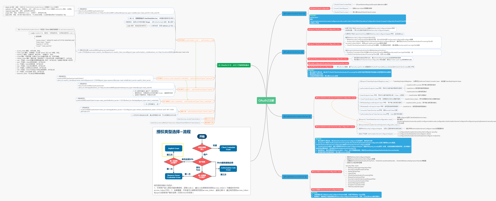

[rfc标准](https://tools.ietf.org/html/rfc6749)  
[spring官方文档](https://docs.spring.io/spring-security-oauth2-boot/docs/current/reference/htmlsingle/)
[官方入门文档](https://projects.spring.io/spring-security-oauth/docs/oauth2.html)  
 
# 理解OAuth 2.0
第一次接触OAuth2是在github API，做接口研究时初步引用了github developer提供的**授权码模式**，当时只是跟着文档走，并没有做深入研究。最近再次接触到是spring boot OAuth2。
当然网上有很多人推荐Apache Shiro，本人并没有深入研究，因为考虑到spring项目对于学习理解的意思更大一些，而且OAuth2已经是主流登录认证方式，因为对于spring OAuth2源码进行了一番研究。

对于OAuth2的理解可以参考这篇文章： [理解OAuth 2.0](https://www.ruanyifeng.com/blog/2014/05/oauth_2_0.html)

网上对于Spring OAuth2的帖子太多太杂，而且大多数都是很简单的例子。这导致本人虽然跑通了，但是对于想要深度控制，实现自己想要的东西，还需要深入研究源码。

## 一、模块说明：
- 认证授权服务：提供认证和授权服务
- 资源服务：提供资源访问
- 客户端：请求资源服务的OAuth2客户端
- 应用系统：提供应用能力的系统，在单点登录sso场景下，每一个需要认证授权服务认证授权的系统，就是一个应用系统。
## 二、常用注解：
spring security oauth2 提供了四个常用注解，来辅助oauth2功能的实现。、
- `@EnableAuthorizationServer`：认证授权服务，提供用于获取token，解析token相关功能，实现认证、授权功能。具体见 Spring Security 文章目录中的 Spring Cloud OAuth2 五种授权方式介绍。
- `@EnableResourceServer`：资源服务，提供基于token的资源访问功能。
- `@EnableOAuth2Client`：客户端，提供OAuth2RestTemplate，用于客户端访问资源服务。 简要步骤：客户端访问资源->客户端发现没有资源访问token->客户端根据授权类型生成跳转url->浏览器 302 到认证授权服务进行认证、授权。
- `@EnableOAuth2Sso`：应用系统，使用远端认证授权服务，替换应用自身的用户登录鉴权security逻辑，实现单点登录功能。 简要步骤：访问应用系统资源-> 应用系统发现未登录-> 302 跳转到登录页面（登录页面地址已经与获取token逻辑自动关联）-> 应用系统发现符合获取token条件，根据授权类型拼装url->302 跳转到认证授权地址（认证授权服务提供）进行认证、授权。

## 三、Annotation加载过程：


# 终极指南
http://www.iocoder.cn/Spring-Security/OAuth2-learning/


---------------------------------------------------------

# springboot 2.0使用spring-security-oauth2的迁移指南

springboot2.0和spring5的改动还是挺多的，帮大家踩下坑  
### 改动一 暴露AuthenticationManager

springboot2.0 的自动配置发生略微的变更，原先的自动配置现在需要通过@Bean暴露，否则你会得到AuthenticationManager找不到的异常

 [点击查看 Security 相关的改动](https://github.com/spring-projects/spring-boot/wiki/Spring-Boot-2.0-Migration-Guide)  
 
```java
@Bean(name = BeanIds.AUTHENTICATION_MANAGER)
@Override
public AuthenticationManager authenticationManagerBean() {
    AuthenticationManager manager = super.authenticationManagerBean();
    return manager;
}
```

### 改动二 添加PasswordEncoder

如果你得到这个异常 java.lang.IllegalArgumentException: There is no PasswordEncoder mapped for the id "null" springboot2.0   
需要增加一个加密器，原来的 plainTextPasswordEncoder 新版本被移除

方法一
```java
@Bean
public PasswordEncoder passwordEncoder() {
  return NoOpPasswordEncoder.getInstance();
}
```
如上是最简单的修改方式，但缺点很明显，是使用明文存储的密码

方法二

```
@Bean
PasswordEncoder passwordEncoder(){
    return new BCryptPasswordEncoder();
}

String finalPassword = new BCryptPasswordEncoder().encode("123456");
String finalSecret = new BCryptPasswordEncoder().encode("123456");
```

配置具体的 BCryptPasswordEncoder，别忘了存储的密码和oauth client 的 secret 也要存储对应的编码过后的密码，而不是明文！

方法三
```
@Bean
PasswordEncoder passwordEncoder(){
    return PasswordEncoderFactories.createDelegatingPasswordEncoder();
}

String finalPassword = "{bcrypt}"+new BCryptPasswordEncoder().encode("123456");
String finalSecret = "{bcrypt}"+new BCryptPasswordEncoder().encode("123456");
```

使用 `PasswordEncoderFactories.createDelegatingPasswordEncoder()` 创建一个 `DelegatingPasswordEncoder`，这个委托者通过密码的前缀来 区分应该使用哪一种编码器去校验用户登录时的密码，**文档中推荐使用这种方式**，并且推荐使用 **`Bcrypt`** 而不是 md5,sha256 之类的算法，
[具体原因看文档了解细节戳这里](https://docs.spring.io/spring-security/site/docs/5.0.4.RELEASE/reference/htmlsingle/)
