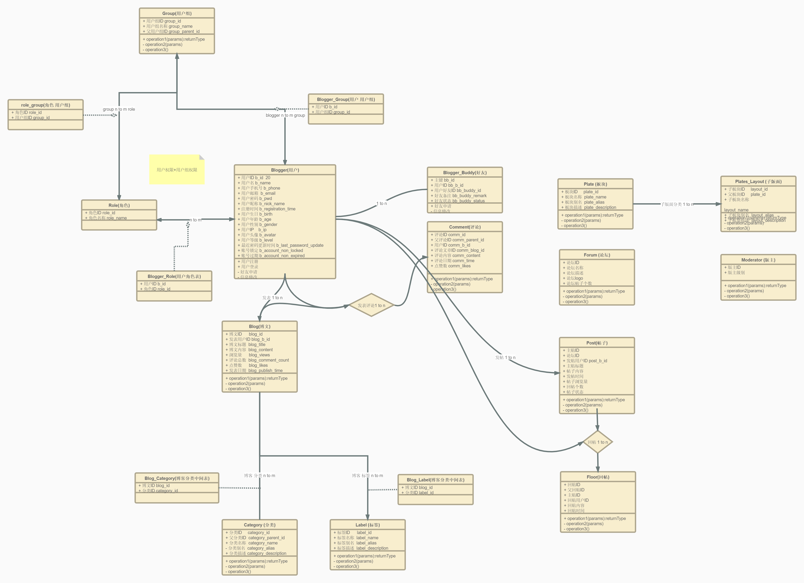

# spring-creed-entity DDD设计
此模块会尽量按照DDD（domain driver design）设计

实现目标有
1. 基本的博客权限管理（基于用户组及个人权限管理）
2. 博客表设计
3. 转型论坛表设计

https://www.processon.com/diagraming/5e804b9ee4b027d999d58005

- [x] 权限管理设计
- [x] 博客表设计
- [ ] 论坛表，施工中。。。

当前E-R图(持续完善中):

[DDD（JPA）设计和代码军规](https://qinnnyul.github.io/2019/04/15/jpa-known-issues/)

*******  
***重点↓***  
[关于JPA的一些讨论](http://www.spring4all.com/question/112)
