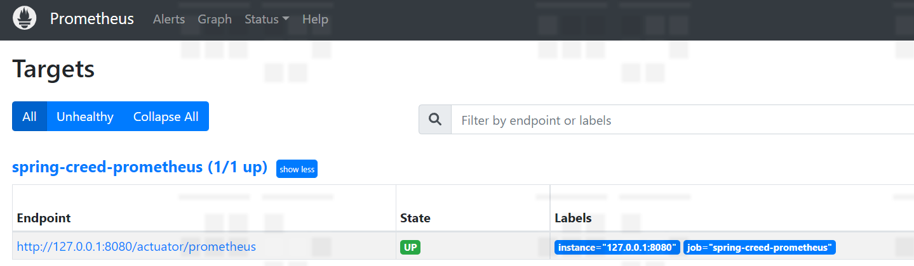
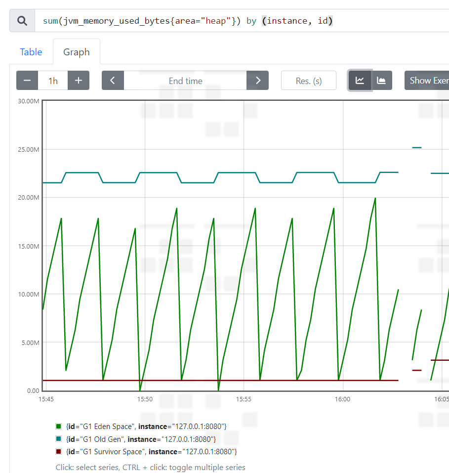
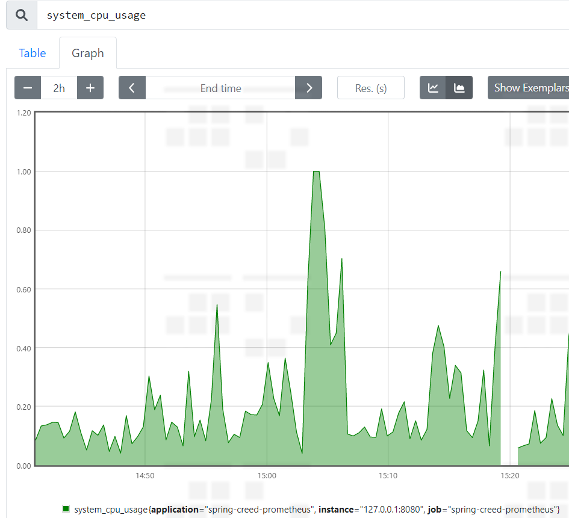
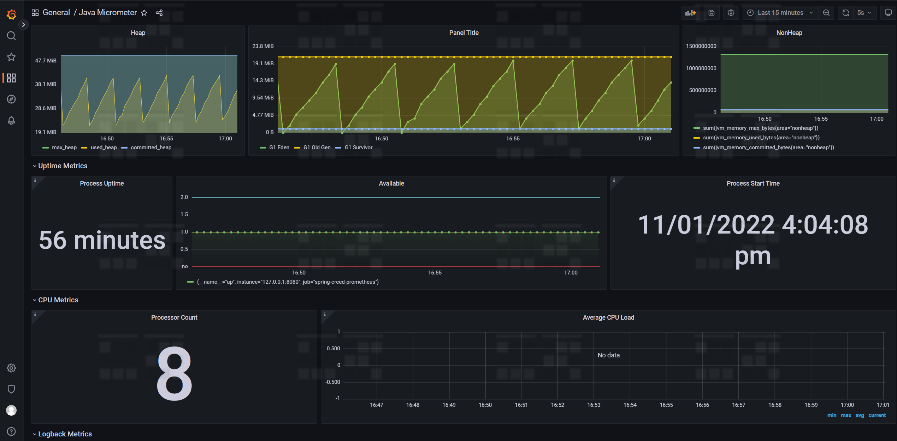
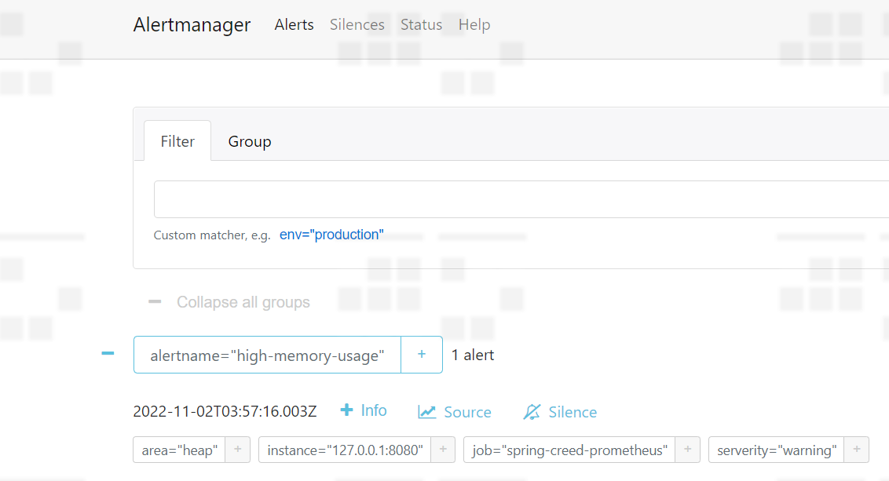
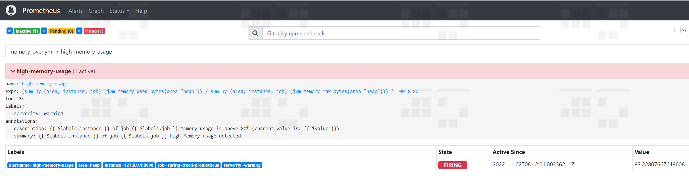

# micrometer使用
## 本篇将使用spring-boot-actuator,prometheus,grafana, alertmanager监控系统
### 1. 配置JVM 参数，便于更好的查看
`-Xmx50m -Xlog:gc*,safepoint:/logs/gc/gc.log:time,uptime,level,tags:filecount=100,filesize=128M`

```yaml
management:
  endpoints:
    web:
      exposure:
        include:
          - prometheus
          - health
          - metrics
  metrics:
    tags:
      application: ${spring.application.name}
    export:
      prometheus:
        enabled: true

      jmx:
        enabled: true

  endpoint:
    health:
      show-details: always
```
### 2. 引入依赖，启动之后，将可以访问以下api,查询
`implementation 'io.micrometer:micrometer-registry-prometheus:1.9.5'`
http://localhost:8080/actuator/prometheus  
http://localhost:8080/actuator/metrics

### 3. prometheus是一个时间序列记录系统和警报的工具包，
  - Prometheus server，它负责抓取和存储时间序列数据，是最主要的组件。[下载](https://prometheus.io/download/#prometheus)
  - client libraries，用于检测应用程序代码的客户端库
  - push gateway，用于支持短期的jobs
  - exporters，用于支持HAProxy等第三方
  - AlertManager，用于处理告警
  - 各种支持工具

  a. 首先去官网下载服务端，配置服务端`prometheus.yml`配置文件，用于抓取数据用于分析
```yaml
# A scrape configuration containing exactly one endpoint to scrape:
# Here it's Prometheus itself.
scrape_configs:
  # The job name is added as a label `job=<job_name>` to any timeseries scraped from this config.
  - job_name: "spring-creed-prometheus"

    # metrics_path defaults to '/metrics'
    # scheme defaults to 'http'.
    metrics_path: '/actuator/prometheus'
    scrape_interval: 2s
    # scrape_timeout: 5s

    static_configs:
      - targets: ["127.0.0.1:8080"]

    tls_config:
      insecure_skip_verify: true
```

检查规则命令：`promtool check config prometheus.yml`

  b. 输入命令，启动服务 `prometheus.exe --config.file=./prometheus.yml`, 打开`http://localhost:9090/`

  

  c. 打开**Graph**导航栏，输入如下表达式，就可以查看拉取的数据
  - `sum(jvm_memory_used_bytes{area="heap"}) by (instance, id)`

  

  - `system_cpu_usage`

  

### 4. 使用Grafana图标工具，支持prometheus状态查看，可以做出炫酷的监控dashboard
去官网下载Grafana安装包，启动`grafana-server`,输入网址`http://localhost:3000/` 默认用户名密码是`admin admin`

1. 配置prometheus -> datasource，导入数据源
2. 进入dashboard导入参考配置如下.
    - **[metrics-dashboard.json](./src/main/resources/metrics-dashboard.json)**
    - [jvmgc-dashboard.json](./src/main/resources/jvmgc-dashboard.json)
    - [latency-dashboard.json](./src/main/resources/latency-dashboard.json)
    - [processor-dashboard.json](./src/main/resources/processor-dashboard.json)
3. 现在能看到漂亮的监控界面啦，通过各种计算方式组合成各种类型的仪表盘




### 5. prometheus整合AlertManager
[DOWNLOAD](https://prometheus.io/download/#alertmanager)
  
  a. 修改 AlertManager 配置文件`alertmanager.yml`，然后启动 AlertManager，访问 `http://localhost:9093/`
   ```yaml
   route:
     group_by: ['alertname']
     group_wait: 10s #组警报等待时间
     group_interval: 10s #组警报间隔时间
     repeat_interval: 1m #重复警报间隔时间
     receiver: 'web.hook'
   receivers:
     - name: 'web.hook'
       webhook_configs:
         - url: 'http://127.0.0.1:8080/api/v1/alert'
   inhibit_rules:
     - source_match:
         severity: 'critical'
       target_match:
         severity: 'warning'
       equal: ['alertname', 'dev', 'instance']
   ```

支持wechat API
[配置文件网址](https://prometheus.io/docs/alerting/latest/configuration/)



  b. 修改`prometheus.yml`配置文件，整合 AlertManager
   ```yaml
   # my global config
   global:
     scrape_interval: 15s # Set the scrape interval to every 15 seconds. Default is every 1 minute.
     evaluation_interval: 15s # Evaluate rules every 15 seconds. The default is every 1 minute.
     # scrape_timeout is set to the global default (10s).
   
   # Alertmanager configuration
   alerting:
     alertmanagers:
       - static_configs:
           - targets:
             # - alertmanager:9093
             - 127.0.0.1:9093 #添加 AlertManager服务地址
   
   # Load rules once and periodically evaluate them according to the global 'evaluation_interval'.
   rule_files:
     # - "first_rules.yml"
     # - "second_rules.yml"
     - "./rules/*.yml"    #添加alertmanager报警规则
   
   # A scrape configuration containing exactly one endpoint to scrape:
   # Here it's Prometheus itself.
   scrape_configs:
     # The job name is added as a label `job=<job_name>` to any timeseries scraped from this config.
     - job_name: "spring-creed-prometheus"
   
       # metrics_path defaults to '/metrics'
       # scheme defaults to 'http'.
       metrics_path: '/actuator/prometheus'
       scrape_interval: 2s
       # scrape_timeout: 5s
   
       static_configs:
         - targets: ["127.0.0.1:8080"]
   
       tls_config:
         insecure_skip_verify: true
   ```
   添加`rules/node-up.yml`
   ```yaml
   groups:
      - name: node-up
        rules:
           - alert: node-up
             expr: up{job="spring-creed-prometheus"} == 0
             for: 2s
             labels:
                serverity: 1
                instance: node
             annotations:
                summary: "{{ $labels.instance }} of job {{ $labels.job }} 已经停止运行超过 2s!" #{{$labels}}中的值是表达式中的值
   ```
   添加`rules/memory_over.yml`
   ```yaml
   groups:
    - name: high-memory-usage
      rules:
        - alert: high-memory-usage
         #  expr: (sum(jvm_memory_used_bytes{area="heap"}) / sum(jvm_memory_max_bytes{area="heap"})) * 100 > 80
          expr: ( sum by (area, instance, job) (jvm_memory_used_bytes{area="heap"}) / sum by (area, instance, job) (jvm_memory_max_bytes{area="heap"})) * 100 > 80
          for: 5s
          labels:
            serverity: warning
          annotations:
            summary: "{{ $labels.instance }} of job {{ $labels.job }} High Memory usage detected"
            description: "{{ $labels.instance }} of job {{ $labels.job }} Memory usage is above 80% (current value is: {{ $value }})" #{{$labels}}中的值是表达式中的值
   ```

   c. 当超过阈值的时候，就能通过web.hook接收到消息了

   

```
alertReceive:{"receiver":"web\\.hook","status":"firing","alerts":[{"status":"firing","labels":{"alertname":"high-memory-usage","area":"heap","instance":"127.0.0.1:8080","job":"spring-creed-prometheus","serverity":"warning"},"annotations":{"description":"127.0.0.1:8080 of job spring-creed-prometheus Memory usage is above 80% (current value is: 93.22807667648608)","summary":"127.0.0.1:8080 of job spring-creed-prometheus High Memory usage detected"},"startsAt":"2022-11-02T08:12:16.003Z","endsAt":"0001-01-01T00:00:00Z","generatorURL":"http://10CNL5CG203849X:9090/graph?g0.expr=%28sum+by+%28area%2C+instance%2C+job%29+%28jvm_memory_used_bytes%7Barea%3D%22heap%22%7D%29+%2F+sum+by+%28area%2C+instance%2C+job%29+%28jvm_memory_max_bytes%7Barea%3D%22heap%22%7D%29%29+%2A+100+%3E+80\u0026g0.tab=1","fingerprint":"fa65a21db3335b7d"}],"groupLabels":{"alertname":"high-memory-usage"},"commonLabels":{"alertname":"high-memory-usage","area":"heap","instance":"127.0.0.1:8080","job":"spring-creed-prometheus","serverity":"warning"},"commonAnnotations":{"description":"127.0.0.1:8080 of job spring-creed-prometheus Memory usage is above 80% (current value is: 93.22807667648608)","summary":"127.0.0.1:8080 of job spring-creed-prometheus High Memory usage detected"},"externalURL":"http://10CNL5CG203849X:9093","version":"4","groupKey":"{}:{alertname=\"high-memory-usage\"}","truncatedAlerts":0}

alertReceive:{"receiver":"web\\.hook","status":"resolved","alerts":[{"status":"resolved","labels":{"alertname":"high-memory-usage","area":"heap","instance":"127.0.0.1:8080","job":"spring-creed-prometheus","serverity":"warning"},"annotations":{"description":"127.0.0.1:8080 of job spring-creed-prometheus Memory usage is above 80% (current value is: 93.22807667648608)","summary":"127.0.0.1:8080 of job spring-creed-prometheus High Memory usage detected"},"startsAt":"2022-11-02T08:12:16.003Z","endsAt":"2022-11-02T08:12:31.003Z","generatorURL":"http://10CNL5CG203849X:9090/graph?g0.expr=%28sum+by+%28area%2C+instance%2C+job%29+%28jvm_memory_used_bytes%7Barea%3D%22heap%22%7D%29+%2F+sum+by+%28area%2C+instance%2C+job%29+%28jvm_memory_max_bytes%7Barea%3D%22heap%22%7D%29%29+%2A+100+%3E+80\u0026g0.tab=1","fingerprint":"fa65a21db3335b7d"}],"groupLabels":{"alertname":"high-memory-usage"},"commonLabels":{"alertname":"high-memory-usage","area":"heap","instance":"127.0.0.1:8080","job":"spring-creed-prometheus","serverity":"warning"},"commonAnnotations":{"description":"127.0.0.1:8080 of job spring-creed-prometheus Memory usage is above 80% (current value is: 93.22807667648608)","summary":"127.0.0.1:8080 of job spring-creed-prometheus High Memory usage detected"},"externalURL":"http://10CNL5CG203849X:9093","version":"4","groupKey":"{}:{alertname=\"high-memory-usage\"}","truncatedAlerts":0}
``` 


InfluxDB u:ethan pwd:ethan123
token: Vlg1ZYDJI9SGRG8smbWv31AJaMasXIIFHTGVkV-jQJvAMGcGL4DeK_i1xAQP1Yi9ikTeR5OoBOQV5duC03haxQ==

